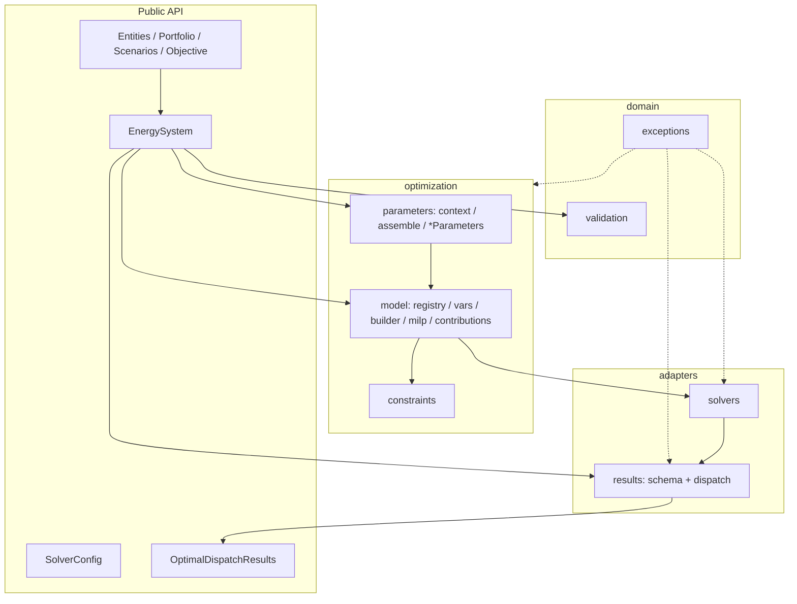

# As-is architecture scorecard

**Snapshot date:** 2026-08-02 (updated after Phases 0–3 + G11a)
**Codebase:** `src/odys` — 68 modules
**Metrics command:** `just architecture-metrics` / `--check` in `just check`
**Status:** Phases 0–3 + **G11a + G12** done. **First-party assets only** (no runtime plugins). Next optional: G10 / Phase 4 per [roadmap.md](roadmap.md).

## 1. Intended pipeline

```
Assets → AssetPortfolio → EnergySystem (validate)
       → ParamBuildContext → build_energy_system_parameters
       → EnergySystemParameters → EnergyAlgebraicModelBuilder → EnergyMILPModel
       → Solver → SolutionSchema → OptimalDispatchResults
```



## 2. Package responsibilities (as implemented)

| Package | Role | Key types |
|---------|------|-----------|
| `domain/` | Entities, scenarios, objective config, validation, exceptions | `EnergyEntity`, `AssetPortfolio`, `Scenario`, `Objective`, `validate_energy_system_inputs` |
| `energy_system.py` | Composition root / facade | `EnergySystem` (fills `ParamBuildContext`, calls assemble) |
| `optimization/parameters/` | Domain → numeric blocks + bag assembly | `ParamBuildContext`, `*Parameters.build`, `build_energy_system_parameters`, `EnergySystemParameters` |
| `optimization/model/` | Dims, vars, registry, builder, MILP facade, contributions, objective | `AssetRegistry`, `AssetSpec`, `EnergyMILPModel`, `build_model` |
| `optimization/constraints/` | Constraint groups | `ConstraintGroup`, `*Constraints` |
| `solvers/` | Solve + map to results schema | `optimize_algebraic_model`, `SolverConfig` |
| `results/` | Solution schema + dispatch views (no optimization imports) | `SolutionSchema`, `OptimalDispatchResults`, `*Dispatch` |
| `utils/` | Logging only | — |

## 3. Structural metrics

### 3.1 Size hotspots (LOC)

| LOC | Module | Cohesion note |
|-----|--------|---------------|
| 608 | `domain.validation` | Large but domain-only (G10 later) |
| 313 | `results.dispatch` | `_DispatchBase` + thin wrappers |
| 240 | `optimization.model.registry` | Asset hub + ports + `build_asset_parameter_blocks` |
| 229 | `optimization.model.milp_model` | Typed accessors + profit collector call |
| 210 | `optimization.model.variables` | Central var catalog |
| 185 | `results.optimization_results` | Schema-backed public root |
| 181 | `parameters.electric_vehicle_parameters` | EV vectorization + `.build` |
| 179 | `optimization.model.model_builder` | Registry iteration |
| 166 | `parameters.scenario_parameters` | Kernel scenario tensors |
| 154 | `energy_system` | Thin context fill + optimize (was ~172) |
| 164 | `domain.entities.portfolio` | Pure domain |
| 84 | `constraints.scenario_constraints` | Balance = contributions + FixedLoad residual |
| 83 | `results.schema` | Dim/var constants + `SolutionSchema` |

### 3.2 Fan-in / fan-out (module hubs)

**High fan-in:**

| Fan-in | Module |
|--------|--------|
| 22 | `optimization.model.sets` |
| 17 | `optimization.model.milp_model` |
| 11 | `domain.exceptions` |
| 10 | `constraints.constraints_group`, `constraints.model_constraint`, `parameters.parameters` |
| 9 | `parameters.build_context` |

**High fan-out:**

| Fan-out | Module |
|---------|--------|
| 29 | `registry` (entities + params + constraints + contributions) |
| 14 | `odys` package root |
| 13 | `milp_model` |
| 12 | `energy_system` (down from ~17 after G11a) |
| 11 | `model_builder` |
| 10 | `parameters.assemble` |

### 3.3 Layer instability

Martin’s metric \(I = C_e / (C_a + C_e)\).

| Layer | Ca | Ce | I | Reading |
|-------|----|----|---|---------|
| `odys.domain.entities` | 37 | 4 | 0.10 | Stable core ✓ |
| `odys.results` | 4 | 1 | **0.20** | Leaf-like after G8 ✓ |
| `odys.domain` | 19 | 6 | 0.24 | Stable ✓ |
| `odys.optimization.parameters` | 25 | 24 | 0.49 | Mid-layer (assemble → registry raises Ce) |
| `odys.solvers` | 3 | 4 | 0.57 | Thin adapter |
| `odys.optimization.constraints` | 10 | 16 | 0.62 | Depends on model |
| `odys.optimization.model` | 25 | 43 | 0.63 | Busy hub |
| `odys.energy_system` | 1 | 12 | 0.92 | Facade ✓ (Ce down after G11a) |
| `odys` (package root) | 0 | 14 | 1.00 | Re-exports ✓ |

`parameters` I rose (was ~0.34) because assemble imports the registry; `energy_system` fan-out dropped accordingly.

### 3.4 Cycles

**AST metrics:** 1 multi-node SCC (14 modules spanning `registry` ↔ `milp_model` ↔ asset constraints ↔ contributions). The architecture graph counts **all** `ast` imports, including `TYPE_CHECKING` blocks.

**Runtime:** acyclic — constraint modules import `EnergyMILPModel` only under `TYPE_CHECKING`; `collect` top-level-imports `AssetRegistry` safely. Parameter assemble → registry is one-way. Verified by package import + full test suite.

**Internal edges:** 235 · **modules:** 68 · **layer violations:** 0

### 3.5 Layer rule violations

| Rule | Status |
|------|--------|
| Domain → optimization / results / solvers / energy_system | **None** |
| Results → optimization (entire tree) | **None** (Phase 3) |
| Constraints → results | **None** |

### 3.6 Churn × structure

`registry`, `milp_model`, and `validation` remain natural change hubs. `energy_system` is thinner after G11a. Contribution ports, results schema, and param factories reduced *where* asset knowledge must land for equations, views, and parameterization.

## 4. Conceptual coupling

### 4.1 Extension cost: new **first-party** dispatchable asset

Maintainer-only path (`AssetRegistry`). Users cannot inject custom assets.

| # | Site | Registry driven? |
|---|------|------------------|
| 1 | Domain entity | No |
| 2 | Portfolio typed property | No |
| 3 | `ModelDimension` (if new axis) | No |
| 4 | `ModelVariable` / `VariableSpec` + list | Partial |
| 5 | `AssetRegistry` entry | **Yes** |
| 6 | `*Parameters.build(ctx)` + ESP field | Factory yes; field still required |
| 7 | `EnergySystem.build_parameters()` switchboard | **Yes** — context fill only (G11a) |
| 8 | Possibly `ScenarioParameters` | No (kernel) |
| 9 | `ModelVariables` field + `ModelVariable` spec | **Yes** (G12) — `model.vars.*` |
| 10 | `*Constraints` class | Wiring free via registry |
| 11 | Power balance / profit | **Yes** — contribution ports |
| 12 | Results dispatch binding (if new public view) | Manual name constants in `results/schema.py` |
| 13 | Validation rules | No (G10) |
| 14 | Tests / docs | No |

**KPI today**

| Kind | Edit sites |
|------|------------|
| Kernel equations (balance/profit composition) | **0** (registry ports) |
| Param assembly switchboard | **0** (G11a) |
| First-party asset (full stack) | **~5–7** |
| Runtime user asset injection | **not supported** |

### 4.2 System-level equations and parameterization

- **Power balance:** `iter_power_balance_contributions` (`AssetRegistry` only) + FixedLoad residual
- **Profit:** `iter_profit_contributions` (`AssetRegistry` only)
- **Param assembly:** `ParamBuildContext` → `*Parameters.build` → `build_energy_system_parameters`
- **G11a tests:** `tests/unit/test_optimization/parameters/test_assemble.py`

### 4.3 Special cases (cognitive load)

| Case | Behavior | Status |
|------|----------|--------|
| `FixedLoad` | Portfolio entity; not in registry; balance residual | G15 later |
| `EnergyMarket` | Registry asset; held on `EnergySystem.markets`; context field | G14 later |
| `Charger` | Registry; no balance/profit ports | By design |
| EV params | `build(ctx)` uses `number_of_steps` | Encoded in factory |
| CVaR | Kernel objective path; not an asset | OK |
| Results | `SolutionSchema`; leaf package | Phase 3 done |
| Scenarios | Kernel `ScenarioParameters` after asset blocks | Not registry |

### 4.4 Public API

**In `__all__`:** entities, portfolio, scenarios, objective, `EnergySystem`, solver config, `OptimalDispatchResults`.

**Deep-importable:** `*Dispatch`, `SolutionSchema` (not root-exported).

**Internal:** `optimization/*` (including `ParamBuildContext`, assemble).

## 5. Package scorecard

Scores: 1 = poor, 5 = excellent.

| Package | Layer purity | Extension | Cohesion | API clarity | Testability | Cognitive load | Notes |
|---------|--------------|-----------|----------|-------------|-------------|----------------|-------|
| `domain.entities` | 5 | 3 | 4 | 5 | 5 | 3 | Pure; markets outside portfolio |
| `domain` (val/obj/scen) | 5 | 3 | 3 | 4 | 5 | 3 | validation size |
| `optimization.parameters` | 4 | 3 | 4 | 4 | 4 | 3 | Factories + assemble; closed bag |
| `optimization.model` | 3 | 4 | 3 | 3 | 3 | 3 | Registry + ports + param blocks |
| `optimization.constraints` | 4 | 4 | 4 | 3 | 4 | 3 | Wiring via registry; balance thin |
| `solvers` | 4 | 5 | 5 | 5 | 4 | 5 | Builds `SolutionSchema` |
| `results` | **5** | 3 | 4 | 4 | 4 | 4 | Leaf after G8; dispatch base after G9 |
| `energy_system` | 4 | 3 | 4 | 5 | 3 | 4 | Thin context → assemble |

**System-wide (post–Phases 0–3 + G11a; first-party only):**

| Axis | Score | One-liner |
|------|-------|-----------|
| Layer purity | **5** | Domain pure; results leaf; CI forbids results→opt |
| Extension cost | **3** | First-party multi-touch; kernel/assembly/vars view closed; no user plugins |
| Cohesion vs size | **3** | validation large; indices still hand-listed |
| Public API stability | **4** | Config + results exported; asset surface = registry |
| Testability | **4** | Unit suite + assemble tests |
| Cognitive load | **3** | FixedLoad / markets ownership remain special |

## 6. Top smells (prioritized)

1. **`validation.py` size** — G10 (pure, low urgency)
2. **FixedLoad / markets language split** — G14 / G15
3. **AST SCC noise from TYPE_CHECKING imports** — metrics limitation; runtime OK
4. ~~MILP property god-object~~ — **fixed G12** (`model.vars`)
5. ~~`build_parameters` switchboard~~ — **fixed G11a**
6. ~~Incomplete contribution ports~~ — **fixed Phase 2**
7. ~~Results → optimization~~ — **fixed Phase 3**
8. ~~Builder switchboard / `lower+"s"`~~ — **fixed Phase 1**
9. ~~Domain → optimization~~ — **fixed Phase 0**

## 7. What is healthy

- Domain purity + CI layer contracts
- Registry-driven vars, asset constraints, balance/profit contributions (**registry only**)
- Registry-driven param block construction (`ParamBuildContext` + `.build`)
- Typed decision-var view (`model.vars` / `ModelVariables`) driven by `ModelVariable`
- Clear product boundary: first-party assets only
- Results leaf (`SolutionSchema`, no optimization imports)
- Generic dispatch base; public `*Dispatch` names preserved
- No runtime import cycles; layer violations = 0
- Stochastic-as-default; solver adapter isolation

## 8. KPI dashboard (aligned with roadmap)

| KPI | Pre-review | After Phase 0 | After Phase 1 | After Phase 2 | After Phase 3 + G11a |
|-----|------------|---------------|---------------|---------------|----------------------|
| Domain → outer leaks | 1 | **0** | 0 | 0 | 0 |
| Kernel equation edits / first-party dispatchable | N | N | N | **0** | 0 |
| Param assembly switchboard | yes | yes | yes | yes | **gone** |
| Runtime user asset injection | n/a | n/a | n/a | tried | **rejected** |
| Production asset edit sites | ~12–15 | ~12–15 | ~10–12 | ~8–10 | **~5–7** |
| Results → optimization | deep | deep | deep | deep | **none** |
| Layer check in CI | no | **yes** | yes | yes | tightened |
| Multi-node SCCs (AST) | 0 | 0 | 0 | 0* | 1* |
| Modules / internal edges | — | — | — | — | **68 / 233** |

\*AST SCC appears with TYPE_CHECKING edges; runtime remains acyclic.
