# Phase 1: Inventory

Factual map of the odys data model on `main` (`edf58ca`), produced per `ARCHITECTURE_REVIEW_METHODOLOGY.md`. It describes what the code **is**, not what it should be. Judgement is deferred to Phase 2; section 7 only lists facts that Phase 2 must look at.

Source: `git archive main` (the working branch `chore/claude-guardrails` has 11 modified `src/` files, mostly lint-driven refactors that do not change the class structure). Line numbers refer to `main`.

Contents:

1. Overview: packages and one-line roles
2. Class catalogue (per layer)
3. Class diagrams (per layer + overview)
4. Sequence diagrams (four main flows)
5. Import graph
6. Flow trace: one `Generator` from input to result
7. Facts carried into Phase 2
8. Checkpoint 1 decisions

---

## 1. Overview

| Package | Modules | Role as the code implies |
| --- | --- | --- |
| `odys` (`__init__.py`) | 1 | Public API: 18 names in `__all__` |
| `odys.domain` | 15 | User-facing pydantic models (assets, scenarios, objective), cross-entity validation, exceptions |
| `odys.parameters` | 9 | Converts domain objects into `xr.DataArray`s, one class per asset type, plus scenario profiles |
| `odys.optimization.model` | 8 | Dimensions, coordinates, variable definitions, linopy model wrapper, builder, objective, (unused) asset registry |
| `odys.optimization.constraints` | 11 | `ConstraintGroup` subclasses per asset type, shared storage-constraint functions |
| `odys.solvers` | 3 | Solver config, option translation, solve call |
| `odys.results` | 2 | Results facade and per-asset dispatch views |
| `odys.energy_system` | 1 | `EnergySystem`: validation entry point, parameter assembly, orchestration of build/solve |
| `odys.utils` | 1 | Logging helpers (no callers in `src/`) |

Totals: 60 modules, ~5,100 lines, 69 classes (pyreverse count), 193 internal import edges.

Public API (`odys/__init__.py`): `AssetPortfolio`, `CVaRTerm`, `Charger`, `ElectricVehicle`, `EnergyMarket`, `EnergySystem`, `FixedLoad`, `FlexibleLoad`, `Generator`, `Objective`, `ProfitTerm`, `Scenario`, `SolverConfig`, `SolverName`, `StandaloneStorage`, `StochasticScenario`, `TradeDirection`, `Trip`. `OptimalDisptachResults` and the dispatch classes are returned to users but not exported.

---

## 2. Class catalogue

Legend: **P** = in `__all__`, **R** = returned to users but not exported, **I** = internal. "Meaning" is the one sentence the code supports today.

### 2.1 Domain (`odys.domain`)

| Class | Kind | API | Meaning | Key fields / methods | Collaborators |
| --- | --- | --- | --- | --- | --- |
| `EnergyEntity` (`entities/base.py:12`) | abstract pydantic base | I | A named, frozen thing in the energy system. | `name` | base of all assets and `EnergyMarket` |
| `Generator` (`entities/generator.py:12`) | pydantic entity | P | A dispatchable generator with cost, ramp, and commitment limits. | `nominal_power`, `variable_cost`, `ramp_up/down`, `min_up/down_time`, `min_power`, `startup/shutdown_cost` | none |
| `Storage` (`entities/storage.py:16`) | abstract pydantic entity | I | Battery physics shared by stationary storage and EVs. | 11 fields (`capacity`, powers, efficiencies, SOC bounds, `degradation_cost`, `self_discharge_rate`); two SOC validators; abstract `asset_type()` | base of `StandaloneStorage`, `ElectricVehicle` |
| `StandaloneStorage` (`entities/standalone_storage.py:10`) | pydantic entity | P | A stationary battery. | `asset_type()` returns `"standalone_storage"` | `Storage` |
| `ElectricVehicle` (`entities/electric_vehicle.py:12`) | pydantic entity | P | An electric vehicle. (Code today models it as a `Storage` subclass with a trip schedule.) | `trips`; `validate_no_overlapping_trips()`, `validate_trips_within_horizon(n)`, `validate_min_soc_at_departure_feasible()` | `Storage`, `Trip` |
| `Trip` (`entities/trip.py:14`) | pydantic value object | P | A time window in which an EV drives and consumes energy. | `start_time`, `end_time` (timestep indices), `energy_consumption`, `min_soc_at_departure` | owned by `ElectricVehicle` |
| `Charger` (`entities/charger.py:12`) | pydantic entity | P | An EV charging point with a power limit. | `max_power`, `efficiency` | none (link to EVs exists only in the model) |
| `FixedLoad` (`entities/fixed_load.py:10`) | pydantic entity | P | A named inelastic demand; the profile lives in `Scenario`. | only `name` | profile in `Scenario.fixed_load_profiles` |
| `FlexibleLoad` (`entities/flexible_load.py:12`) | pydantic entity | P | A demand that can deviate from a base profile. | `max_increase`, `max_decrease`, `value_of_consumption` | base profile in `Scenario.flexible_load_base_profiles` |
| `EnergyMarket` (`entities/market.py:23`) | pydantic entity | P | A market to exchange energy. (Fields: volume cap, allowed direction, optional stage-fixing.) | `max_trading_volume_per_step`, `trade_direction`, `stage_fixed` | prices in `Scenario.market_prices`; passed to `EnergySystem.markets`, not to the portfolio |
| `TradeDirection` (`entities/market.py:10`) | `StrEnum` | P | Allowed trade direction of a market. **Decided: rename to `AllowedTradeDirection`** (see section 8). | `BUY_ONLY`, `SELL_ONLY`, `BUY_AND_SELL` | `EnergyMarket` |
| `AssetPortfolio` (`entities/portfolio.py:24`) | plain class | P | A name-indexed set of assets with typed filters. | `_assets: dict`; `get_asset`, `assets`, and one property per asset type (`generators`, `standalone_storages`, `fixed_loads`, `flexible_loads`, `loads`, `electric_vehicles`, `chargers`) | imports 6 concrete asset classes |
| `Scenario` (`scenarios.py:17`) | pydantic value object | P | One realization of exogenous time series, keyed by asset name. | `available_capacity_profiles`, `fixed_load_profiles`, `flexible_load_base_profiles`, `market_prices` (all `Mapping[str, Sequence[float]] \| None`) | refers to assets by string name |
| `StochasticScenario` (`scenarios.py:53`) | pydantic value object | P | A `Scenario` with a name and probability. | `name`, `probability` | `Scenario` |
| `ObjectiveTerm` (`objective.py:10`) | pydantic base | I | A weighted objective contribution. | `weight` | base of `ProfitTerm`, `CVaRTerm` |
| `ProfitTerm` (`objective.py:31`) | pydantic value object | P | Weight for expected profit. | (inherits `weight`) | none |
| `CVaRTerm` (`objective.py:40`) | pydantic value object | P | Weight and confidence level for CVaR. | `confidence_level` | none |
| `Objective` (`objective.py:59`) | pydantic value object | P | Profit term plus optional CVaR term. | `profit`, `cvar` | fixed composition of the two terms (no list of terms). No explicit `model_config`, so it is mutable, unlike the other models |
| `OdysError` + 3 subclasses (`exceptions.py`) | exceptions | I | Error hierarchy. | none | raised everywhere (fan-in 17) |

Module-level functions in the domain layer: `validate_sequence_of_stochastic_scenarios` (`scenarios.py:71`) and 16 functions in `validation.py` (608 lines). The entry point is `validate_energy_system_inputs` (`validation.py:21`).

### 2.2 Composition root (`odys.energy_system`)

| Class | Kind | API | Meaning | Key fields / methods | Collaborators |
| --- | --- | --- | --- | --- | --- |
| `EnergySystem` (`energy_system.py:39`) | pydantic model | P | The validated problem definition that also builds and solves itself. | `portfolio`, `timestep`, `number_of_steps`, `objective`, `markets`, `scenarios`; `collection_of_scenarios`, `collection_of_markets`, `build_parameters()`, `optimize()` | 19 imports: domain, parameters (7 classes), coordinates, dimensions, builder, solver, results |

### 2.3 Parameters (`odys.parameters`)

All `*Parameters` asset classes follow one shape: `__init__(Sequence[Entity])` raises on empty input, builds one private `xr.Dataset` over the asset dimension, and exposes one `xr.DataArray` property per field.

| Class | Kind | API | Meaning | Key fields / methods | Collaborators |
| --- | --- | --- | --- | --- | --- |
| `EnergySystemParameters` (`energy_system_parameters.py:22`) | pydantic model | I | The complete numeric input of one optimization problem: coordinates, per-asset arrays, scenario profiles, timestep, and objective. **Name and meaning to be revisited in Phase 2** (see section 8). | `timestep`, `objective` (domain object), `scenarios`, `coordinates_store`, six optional `*Parameters` | all `*Parameters`, `CoordinatesStore`, `Objective` |
| `GeneratorParameters` (`entity_parameters/generator_parameters.py:12`) | plain class | I | Generator fields as arrays over `generator`. | 9 properties | `Generator`, `ModelDimension` |
| `StandaloneStorageParameters` (`…/standalone_storage_parameters.py:12`) | plain class | I | Storage fields as arrays over `standalone_storage`. | 11 properties | `StandaloneStorage` |
| `ElectricVehicleParameters` (`…/electric_vehicle_parameters.py:13`) | plain class | I | EV battery fields over `ev`, plus trip arrays over `ev × time`. | 11 battery properties plus `is_driving`, `trip_energy`, `min_soc_at_departure`; takes `number_of_timesteps` and builds its own time coordinates (`:40`) | `ElectricVehicle`, `Trip` |
| `ChargerParameters` (`…/charger_parameters.py:12`) | plain class | I | Charger fields over `charger`. | `max_power`, `efficiency` | `Charger` |
| `FlexibleLoadParameters` (`…/flexible_load_parameters.py:12`) | plain class | I | Flexible-load fields over `flexible_load`. | `max_increase`, `max_decrease`, `value_of_consumption` | `FlexibleLoad` |
| `MarketParameters` (`…/market_parameters.py:12`) | plain class | I | Market fields over `market`. | `max_volume`, `stage_fixed`, `trade_direction` | `EnergyMarket` |
| `ScenarioParameters` (`…/scenario_parameters.py:13`) | plain class | I | Scenario time series as arrays over `scenario × [asset] × time`. | `fixed_load_profiles` (summed over loads), `flexible_load_base_profiles`, `market_prices`, `available_capacity_profiles`, `scenario_probabilities` (all `cached_property`); `time_index`, `scenario_index` | `StochasticScenario`, `CoordinatesStore` |

Note: `Storage` has one domain class hierarchy but **two** unrelated parameter classes with the same 11 fields (`StandaloneStorageParameters`, `ElectricVehicleParameters`).

### 2.4 Optimization model (`odys.optimization.model`)

| Class | Kind | API | Meaning | Key fields / methods | Collaborators |
| --- | --- | --- | --- | --- | --- |
| `ModelDimension` (`dimensions.py:6`) | `StrEnum` | I (leaks via result coords) | Names of all array axes: `scenario`, `time`, and one per asset type. | 8 members | fan-in 19, the most-imported module |
| `ModelCoordinates` (`coordinates.py:10`) | pydantic model (declared `ABC`, but concrete) | I | Labels along one dimension. | `dimension`, `values`; `dimension_coordinates_map` | `ModelDimension` |
| `CoordinatesStore` (`coordinates.py:27`) | pydantic model | I | Labels for every dimension; asset dimensions optional. | 8 fields mirroring `ModelDimension`; `get_coordinates(dim)` with a hand-written mapping (`:51`) | `ModelCoordinates` |
| `BoundType` (`variable_definitions.py:14`) | `Enum` | I | Lower-bound kind. | `NON_NEGATIVE`, `UNBOUNDED` | none |
| `VariableDefinition` (`variable_definitions.py:21`) | pydantic model | I | Spec of one decision variable. | `name`, `is_binary`, `dimensions`, `lower_bound_type` | `ModelDimension` |
| `VariableDefinitionRegistry` (`variable_definitions.py:36`) | `Enum` of `VariableDefinition` | I | The list of all 21 decision variables. | members plus proxy properties; module-level groups `GENERATOR_VARIABLES` … `CVAR_VARIABLES` derived by dimension membership (`:187-217`) | `VariableDefinition` |
| `LinopyVariableParameters` (`linopy_converter.py:12`) | pydantic model | I | Arguments for `linopy.Model.add_variables`. | `name`, `coords`, `lower`, `binary` | built by `get_linopy_variable_parameters` |
| `VariableStore` (`milp_model.py:19`) | plain class | I | Typed attribute view of linopy variables. | 21 annotated `linopy.Variable` attributes set with `setattr` in a loop (`:55-56`); absent variables raise `AttributeError` | `linopy.Model` |
| `EnergyMILPModel` (`milp_model.py:59`) | plain class | I | linopy model plus parameters plus typed variables plus profit expression. | `linopy_model`, `parameters`, `vars`, `add_variable()`, `per_scenario_profit()` (60 lines of per-asset profit terms, `:100-159`) | `EnergySystemParameters`, `VariableStore`, linopy |
| `EnergyAlgebraicModelBuilder` (`model_builder.py:39`) | plain class, single use | I | Adds variables, constraint groups, and objective to an `EnergyMILPModel`. | `build()`, `_add_model_variables()` (7 `if` branches), `_get_constraint_groups()` (8 branches) | all 8 `ConstraintGroup`s, variable groups, `build_objective` |
| `AssetSpec` / `AssetRegistry` (`registry.py:36`, `:52`) | dataclass / `Enum` | I | Entity class, parameter class, dimension, variables per asset type. | 6 members | **no callers in `src/`, tests, or examples** |

Module-level functions: `build_model` (`model_builder.py:151`), `build_objective` / `_profit_expr` / `_cvar_expr` (`objectives.py`), `get_linopy_variable_parameters` (`linopy_converter.py:26`).

### 2.5 Constraints (`odys.optimization.constraints`)

| Class | Kind | API | Meaning | Key fields / methods | Collaborators |
| --- | --- | --- | --- | --- | --- |
| `ModelConstraint` (`model_constraint.py:7`) | pydantic model | I | A named linopy constraint. | `constraint`, `name` | linopy |
| `ConstraintGroup` (`constraints_group.py:21`) | base class | I | A set of `@constraint` methods discovered at subclass time. | `_constraint_methods`, `collect_constraints()`, `add_to_model(linopy.Model)`; module-level `_constraint_registry` dict plus `constraint` decorator | `ModelConstraint` |
| `GeneratorConstraints` (`generator_constraints.py:16`) | `ConstraintGroup` | I | 13 generator constraints (limits, start/stop logic, min up/down, ramps). | min up/down loop per generator in Python (`:111-145`) | `EnergyMILPModel`, `GeneratorParameters`, `CoordinatesStore.generators` |
| `StandaloneStorageConstraints` (`standalone_storage_constraints.py:28`) | `ConstraintGroup` | I | 9 storage constraints via shared `storage_constraints` functions. | each method delegates to a `build_*` function | `EnergyMILPModel`, `StandaloneStorageParameters` |
| `ElectricVehicleConstraints` (`electric_vehicle_constraints.py:28`) | `ConstraintGroup` | I | Same 9 storage constraints plus driving and departure-SOC. | 11 methods | `EnergyMILPModel`, `ElectricVehicleParameters` |
| `ChargerConstraints` (`charger_constraints.py:17`) | `ConstraintGroup` | I | Charger-EV assignment and power limits. | 4 methods | needs **both** `ChargerParameters` and `ElectricVehicleParameters` |
| `MarketConstraints` (`market_constraints.py:16`) | `ConstraintGroup` | I | Volume caps, buy/sell exclusivity, trade direction. | 5 methods | `MarketParameters`, `TradeDirection` (domain) |
| `FlexibleLoadConstraints` (`flexible_load_constraints.py:15`) | `ConstraintGroup` | I | Adjustment bounds. | 2 methods | `FlexibleLoadParameters` |
| `ScenarioConstraints` (`scenario_constraints.py:11`) | `ConstraintGroup` | I | Power balance (all asset types), available capacity, non-anticipativity. | power balance has one `if` per asset type (`:19-53`) | every asset's variables, `ScenarioParameters`, `MARKET_VARIABLES` |
| `CVaRConstraints` (`cvar_constraints.py:8`) | `ConstraintGroup` | I | CVaR shortfall constraint. | 1 method | `EnergyMILPModel.per_scenario_profit()` |

Module-level functions: 10 `build_*` functions in `storage_constraints.py` shared by storage and EV groups.

Every `ConstraintGroup` subclass takes the whole `EnergyMILPModel` and pulls its own parameter block from `milp_model.parameters`, raising `ValueError` (not an `Odys*` error) if the block is `None`.

### 2.6 Solvers (`odys.solvers`)

| Class | Kind | API | Meaning | Key fields / methods | Collaborators |
| --- | --- | --- | --- | --- | --- |
| `SolverName` (`solver_config.py:9`) | `StrEnum` | P | Supported solvers. | `HIGHS`, `GUROBI`, `CPLEX`, `SCIP` | none |
| `SolverConfig` (`solver_config.py:18`) | pydantic model | P | Common solver options plus raw overrides. | `solver_name`, `time_limit`, `mip_rel_gap`, `presolve`, `threads`, `log_output`, `solver_options` (not read by any translator) | none |
| `SolverOptionTranslator` (`config_translators.py:12`) | `Protocol` | I | Maps `SolverConfig` to solver kwargs. | `translate(config)` | 4 implementations |
| `HiGHS/Gurobi/CPLEX/SCIPOptionTranslator` (`config_translators.py:20-86`) | plain classes | I | Per-solver option names. | `translate` | `SolverConfig` |

Module-level functions: `optimize_algebraic_model` (`solver.py:17`) solves **and constructs the results object**; `validate_solver_available` (`:52`); `translate_solver_config` (`config_translators.py:89`).

### 2.7 Results (`odys.results`)

| Class | Kind | API | Meaning | Key fields / methods | Collaborators |
| --- | --- | --- | --- | --- | --- |
| `OptimalDisptachResults` (`optimization_results.py:20`) | plain class, `__slots__` | R | Solved-model snapshot with typed accessors per asset type. | `solver_status`, `termination_condition`, `objective_value`, `to_dataset()`; one property per asset type returning a `*Dispatch`; `_has_*` flags derived from solution dims | `VariableDefinitionRegistry`, `ModelDimension`, `EnergySystemParameters` (only for flexible-load base profiles) |
| `GeneratorDispatch`, `StandaloneStorageDispatch`, `ElectricVehicleDispatch`, `ChargerDispatch`, `MarketDispatch`, `FlexibleLoadDispatch` (`dispatch.py`) | plain classes, `__slots__` | R | Per-asset result view; indexable by asset name, iterable, convertible to pandas/xarray. | each repeats `__getitem__`, `__iter__`, `__len__`, `__contains__`, `to_dataset`, `to_dataframe`, `__repr__` (6 × ~75 lines) | `ModelDimension`; `__getitem__` uses literal keyword names such as `sel(generator=key)` |

---

## 3. Class diagrams

Only members that matter for responsibilities are shown. `«P»` marks public classes, `«R»` returned-but-unexported.

### 3.1 Overview (packages and main dependencies)

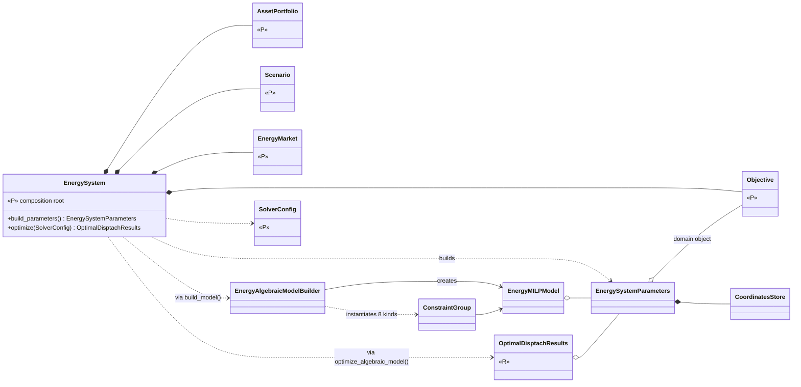

### 3.2 Domain

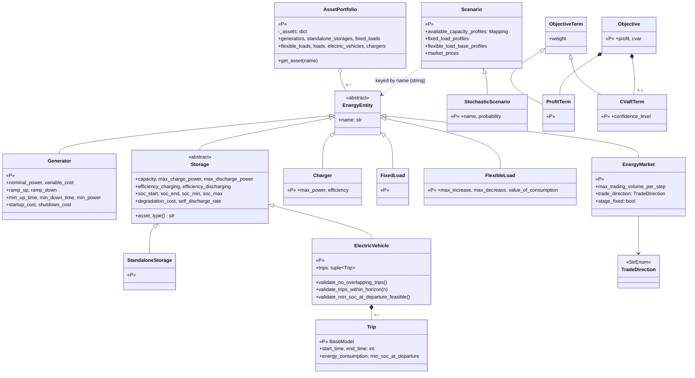

`validation.py` (16 functions) sits beside these classes and reads `AssetPortfolio`, `StochasticScenario`, `EnergyMarket` and the concrete asset classes. It is not a class and is not drawn.

### 3.3 Parameters

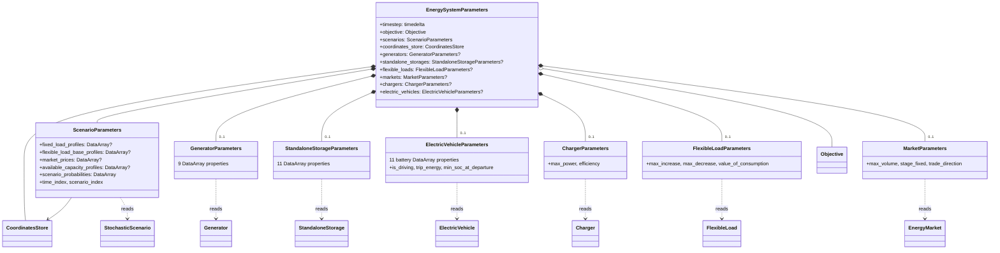

There is no common base or protocol for `*Parameters`. The shape is shared by convention only.

### 3.4 Optimization model

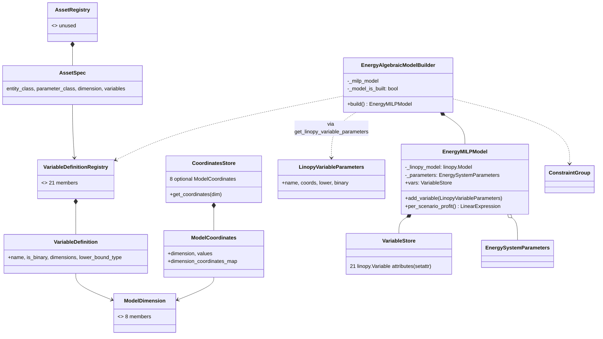

### 3.5 Constraints

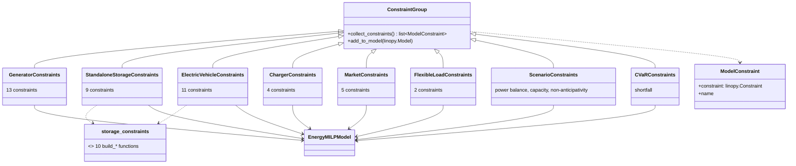

Each subclass reaches through `EnergyMILPModel` to both `.vars` (variables) and `.parameters.<asset>` (data). The base class knows only `linopy.Model`.

### 3.6 Solvers and results

```mermaid
classDiagram
    class SolverName {
        <<StrEnum>> «P»
    }
    class SolverConfig {
        «P» +solver_name, time_limit, mip_rel_gap, presolve, threads, log_output, solver_options
    }
    class SolverOptionTranslator {
        <<Protocol>> +translate(config) dict
    }
    class HiGHSOptionTranslator
    class GurobiOptionTranslator
    class CPLEXOptionTranslator
    class SCIPOptionTranslator
    class OptimalDisptachResults {
        «R»
        +solver_status, termination_condition, objective_value
        +to_dataset()
        +generators, standalone_storages, electric_vehicles
        +chargers, markets, flexible_loads
    }
    class GeneratorDispatch {
        «R»
    }
    class StandaloneStorageDispatch {
        «R»
    }
    class ElectricVehicleDispatch {
        «R»
    }
    class ChargerDispatch {
        «R»
    }
    class MarketDispatch {
        «R»
    }
    class FlexibleLoadDispatch {
        «R»
    }

    SolverConfig --> SolverName
    SolverOptionTranslator <|.. HiGHSOptionTranslator
    SolverOptionTranslator <|.. GurobiOptionTranslator
    SolverOptionTranslator <|.. CPLEXOptionTranslator
    SolverOptionTranslator <|.. SCIPOptionTranslator
    SolverOptionTranslator ..> SolverConfig
    OptimalDisptachResults ..> GeneratorDispatch : creates
    OptimalDisptachResults ..> StandaloneStorageDispatch : creates
    OptimalDisptachResults ..> ElectricVehicleDispatch : creates
    OptimalDisptachResults ..> ChargerDispatch : creates
    OptimalDisptachResults ..> MarketDispatch : creates
    OptimalDisptachResults ..> FlexibleLoadDispatch : creates
    OptimalDisptachResults o-- EnergySystemParameters
    OptimalDisptachResults ..> VariableDefinitionRegistry : variable names
```

---

## 4. Sequence diagrams

Lifelines are real classes or modules. Messages are real methods.

### 4.1 Construction and validation: `EnergySystem(...)`

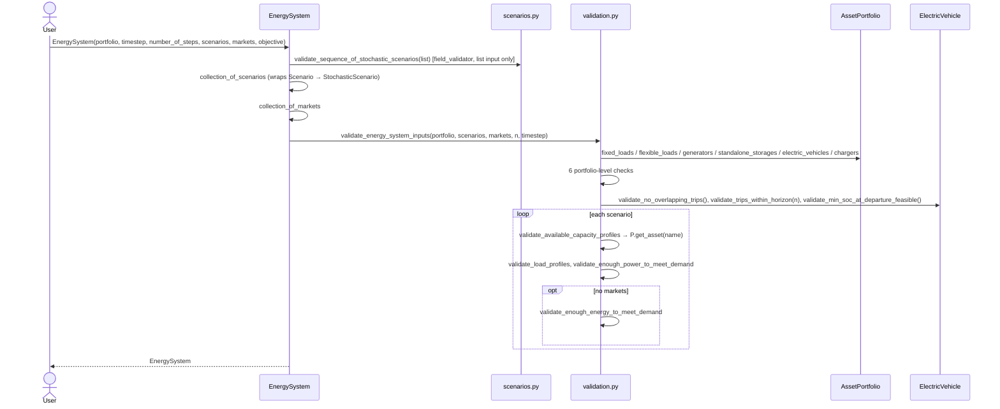

### 4.2 `EnergySystem.optimize()` end to end

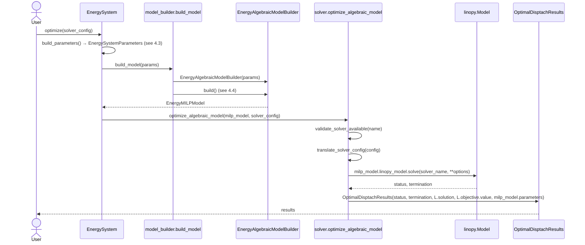

### 4.3 `EnergySystem.build_parameters()`

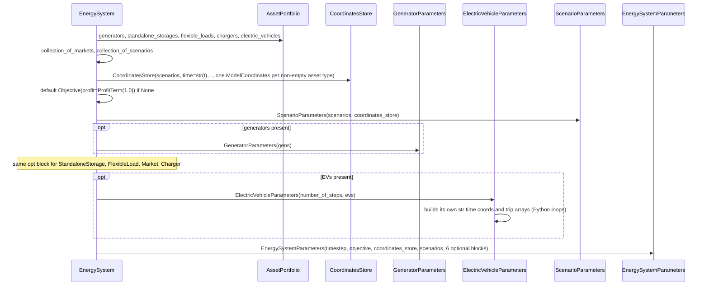

### 4.4 Model building: `EnergyAlgebraicModelBuilder.build()`

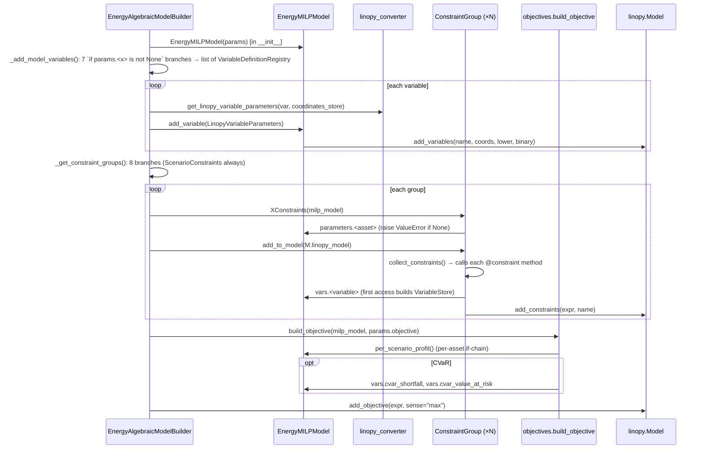

### 4.5 Results extraction

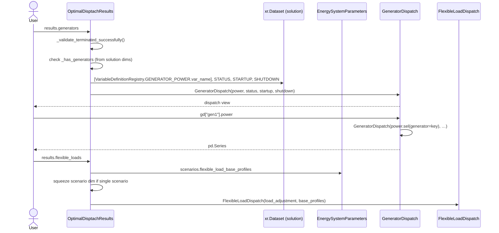

---

## 5. Import graph

Computed with an AST walk over `main` (`from odys… import` statements, 193 edges). Package-level edges:

| From \ To | domain | parameters | optimization.model | optimization.constraints | solvers | results | energy_system |
| --- | --- | --- | --- | --- | --- | --- | --- |
| **domain** | internal | | | | | | |
| **parameters** | 8 modules | internal | 8 modules (`dimensions`, `coordinates`) | | | | |
| **optimization.model** | `milp_model`, `model_builder`, `objectives`, `registry` | `milp_model`, `model_builder`, `registry` | internal | `model_builder` | | | |
| **optimization.constraints** | `scenario_constraints` (exceptions), `market_constraints` (`TradeDirection`) | 6 modules (**TYPE_CHECKING only**) | all 9 modules (`dimensions` at runtime; `milp_model` mostly TYPE_CHECKING) | internal | | | |
| **solvers** | `solver` | | `solver` | | internal | `solver` | |
| **results** | `optimization_results` | `optimization_results` | `dispatch`, `optimization_results` | | | internal | |
| **energy_system** | yes | yes (7 classes) | `coordinates`, `dimensions`, `model_builder` | | yes | yes | |

Observed structure:

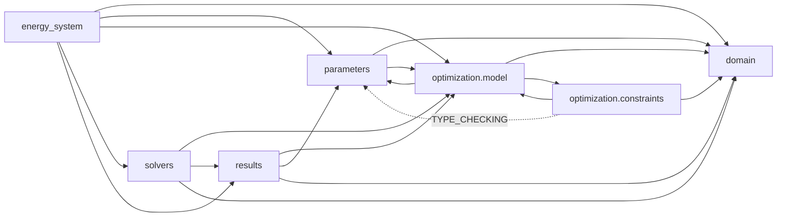

Facts from the graph:

- **Package-level cycles:** `parameters ⇄ optimization.model` (parameters use `dimensions`/`coordinates`; `milp_model`, `model_builder`, `registry` use parameters) and `optimization.model ⇄ optimization.constraints` (builder instantiates groups; groups type against `EnergyMILPModel`). Neither is a module-level import cycle, so Python and import-linter accept them.
- **Fan-in:** `optimization.model.dimensions` 19, `domain.exceptions` 17, `optimization.model.milp_model` 11, `constraints.model_constraint` 10, `constraints.constraints_group` 9.
- **Fan-out:** `energy_system` 19, `model_builder` 15, `registry` 15, `odys/__init__` 13, `energy_system_parameters` 9, `validation` 8, `portfolio` 8.
- `solvers.solver` constructs `results.OptimalDisptachResults`, so solving and result shaping are coupled.
- `results` reads variable names from `optimization.model.variable_definitions` and profiles from `parameters`.
- **Contracts:** `main` has no import-linter contracts. The five contracts on `chore/claude-guardrails` all pass (`uv run --locked lint-imports`: 5 kept). They allow the two cycles above.

---

## 6. Flow trace: one `Generator`, input to result

| Stage | Representation | Where |
| --- | --- | --- |
| User input | `Generator(name="gen1", nominal_power=100, variable_cost=20, …)` | `domain/entities/generator.py:12` |
| Grouping | Entry in `AssetPortfolio._assets`; retrieved via `portfolio.generators` (isinstance filter) | `portfolio.py:96` |
| Exogenous data | `Scenario.available_capacity_profiles["gen1"]`: string-keyed, separate from the entity | `scenarios.py:35` |
| Validation | `validate_available_capacity_profiles` looks the name up with `portfolio.get_asset`; power/energy sufficiency checks sum generator fields | `validation.py:287`, `:370`, `:461` |
| Coordinates | `ModelCoordinates(dimension=ModelDimension.Generators, values=("gen1",…))` in `CoordinatesStore.generators` | `energy_system.py:145` |
| Parameters | `GeneratorParameters`: 9 `DataArray`s over `generator` (e.g. `ramp_up` is renamed `max_ramp_up`) | `generator_parameters.py:37-38` |
| Scenario parameters | `ScenarioParameters.available_capacity_profiles`: `scenario × generator × time`, missing profiles filled with `inf` | `scenario_parameters.py:117` |
| Variables | 4 registry entries (`GENERATOR_POWER/STATUS/STARTUP/SHUTDOWN`) selected by dimension into `GENERATOR_VARIABLES`; builder adds them when `params.generators is not None` | `variable_definitions.py:39-62`, `:187`; `model_builder.py:87` |
| Typed access | `milp_model.vars.generator_power` (attribute set via `setattr`) | `milp_model.py:26`, `:55` |
| Constraints | `GeneratorConstraints` (13 constraints) plus `ScenarioConstraints` power balance and available-capacity terms | `generator_constraints.py`, `scenario_constraints.py:24`, `:56` |
| Objective | cost terms inside `EnergyMILPModel.per_scenario_profit()` | `milp_model.py:116-123` |
| Solution | `solution["generator_power"]` etc. in the linopy solution dataset | `solver.py:46` |
| Result | `results.generators` → `GeneratorDispatch(power, status, startup, shutdown)`; `results.generators["gen1"].power` → `pd.Series` | `optimization_results.py:86`, `dispatch.py:13` |

The concept "generator" appears in **18 files** across 6 packages (`grep -il generator`, excluding docstring-only mentions in `base.py` and `flexible_load.py`), with the name repeated in: the entity class, a portfolio property, a scenario field, validation functions, a `CoordinatesStore` field, a `ModelDimension` member, a parameters class, an `EnergySystemParameters` field, 4 registry entries plus a variable group, 4 `VariableStore` attributes, a builder branch (×2), a constraint group, a power-balance branch, a profit branch, a results property, a dispatch class, and an `AssetRegistry` member.

---

## 7. Facts carried into Phase 2

These are observations, not findings. Phase 2 decides which of them are problems.

1. **Per-asset lockstep structures.** Each asset type is listed separately in: `AssetPortfolio` properties, `Scenario` fields, `CoordinatesStore` fields and `get_coordinates` mapping, `ModelDimension`, `EnergySystemParameters` fields, `EnergySystem.build_parameters` (2 places), variable groups, `VariableStore`, `_add_model_variables`, `_get_constraint_groups`, power balance, `per_scenario_profit`, `OptimalDisptachResults` (property plus `_has_*` flag plus `__slots__`), a `*Dispatch` class, and `AssetRegistry`.
2. **`AssetRegistry` has no callers** (`registry.py:52`). It is the only place that ties entity, parameters, dimension, and variables together.
3. **Behaviour placement.** Domain entities carry almost no behaviour (exceptions: `Storage` validators, three `ElectricVehicle.validate_*` methods invoked from `validation.py`, `Storage.asset_type()` with no callers). Asset-specific logic lives in `validation.py`, `*Parameters`, `*Constraints`, `per_scenario_profit`, power balance, and `*Dispatch`.
4. **`EnergyMILPModel`** holds the linopy model, the parameters, the typed variables, and the profit expression for all asset types.
5. **`EnergySystem`** is both the validated problem definition and the orchestrator of parameters, build, and solve.
6. **Storage duplication across layers.** One `Storage` base in the domain, but two independent 11-field parameter classes, two constraint groups sharing free functions, and two near-identical dispatch classes.
7. **Scenario data is string-keyed by asset name** and stored apart from the asset (`Scenario` has one field per asset kind).
8. **`EnergyMarket` is an `EnergyEntity` but is not part of `AssetPortfolio`**. It is passed separately to `EnergySystem.markets`. `AssetPortfolio` accepts any `EnergyEntity`, so a market placed in it would have no accessor.
9. **Constraint groups** receive the whole `EnergyMILPModel` and navigate `model.vars.*` and `model.parameters.*`. Missing blocks raise `ValueError`, not `OdysError`.
10. **Results depend on internal names**: `VariableDefinitionRegistry` names, `ModelDimension` values as `sel()` keywords, and `EnergySystemParameters` for flexible-load base profiles. Six dispatch classes repeat the same container protocol.
11. **Solver layer builds results** (`solver.py:43`), and `SolverConfig.solver_options` is never read.
12. **Two package-level cycles** (`parameters ⇄ optimization.model`, `optimization.model ⇄ optimization.constraints`), caused by `dimensions`/`coordinates` living in `optimization.model` and `EnergyMILPModel` depending on parameters.
13. **Minor facts:** `Objective` lacks `frozen` config. `ModelCoordinates` is declared `ABC` but instantiated. `Trip` is not an `EnergyEntity`. `utils.logging`, `ScenarioParameters.time_index`/`scenario_index`, and `Storage.asset_type()` have no callers in `src/`. The class name is spelled `OptimalDisptachResults`.

### Tooling notes for later phases

- `uvx --from pylint pyreverse -o mmd -p odys odys` (run inside `src/`) works and extracts all 69 classes and the inheritance edges. It found only 12 associations, missing optional fields, `xarray`-typed members, and every `ConstraintGroup → EnergyMILPModel` link, so the diagrams above were drawn by hand from the code.
- Import graph script: an AST walk grouping modules by package. It can be re-run on the target branch in Phase 3 to compare edges.

---

## 8. Checkpoint 1 decisions

Recorded from the user's review of this inventory (2026-09-30). The map is accepted with these corrections. Items 3 and 4 are inputs to Phase 2 and Phase 3. Nothing is changed in code during the review.

1. **`ElectricVehicle`** means "an electric vehicle". Its modelling as a `Storage` subclass is an implementation choice to be judged in Phase 2, not part of its meaning.
2. **`EnergyMarket`** means "a market to exchange energy".
3. **`TradeDirection` will be renamed to `AllowedTradeDirection`.** This is a public API change (`__all__`), and the roadmap must include it.
4. **`EnergySystemParameters` needs a better, self-describing name and definition.** Phase 2 records it as a naming finding, and Phase 3 proposes the name together with the target model. The name should say what the object is (the numeric input of one optimization problem), not which layer it belongs to.
5. **`Scenario` / `StochasticScenario`** and their string-keyed profiles are part of the data model under redesign, not fixed user input.
