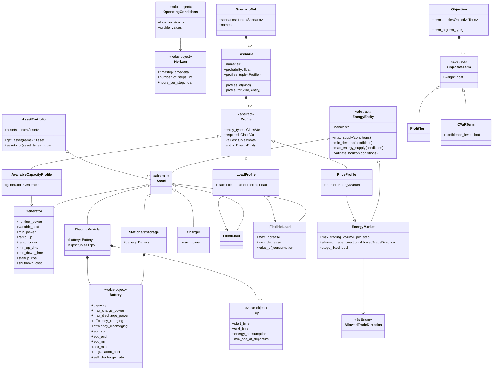
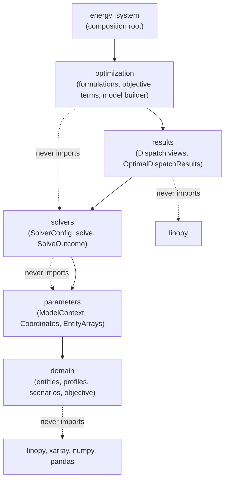
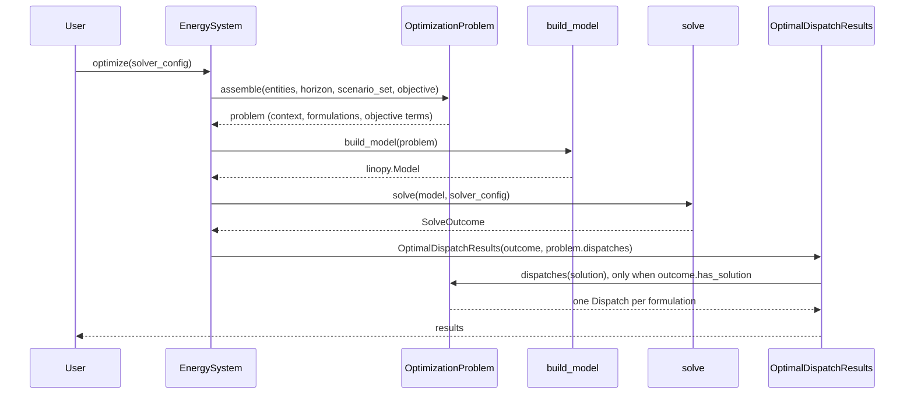
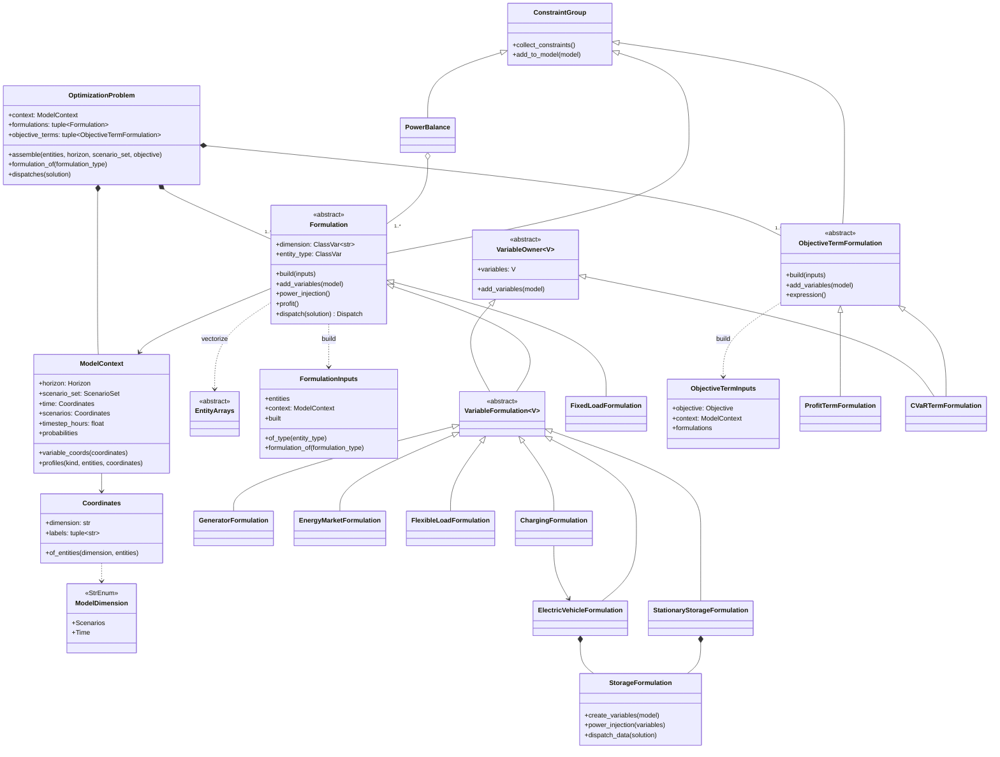
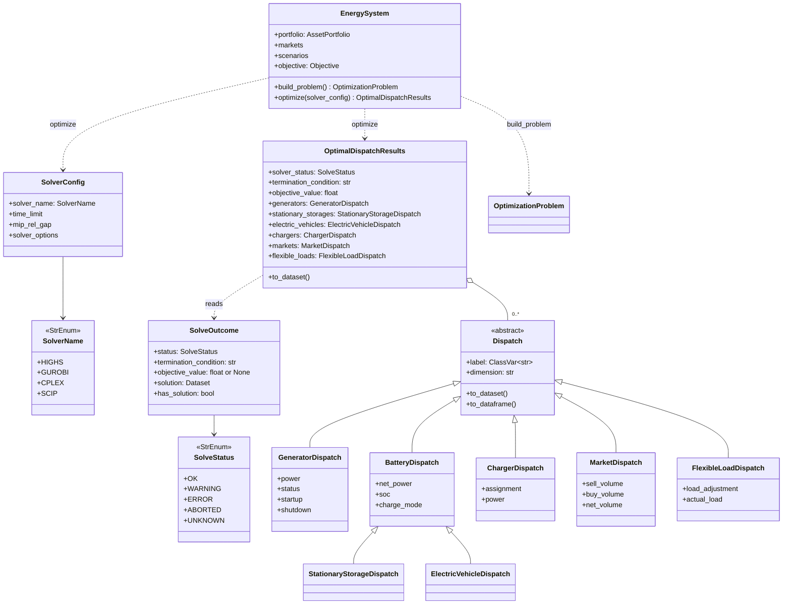

# Architecture model

This page describes how odys is put together: the package layers, the `optimize()` pipeline, and the classes of each layer. It is meant for contributors; users only need the [user guide](../user_guide/energy_system.md).

## Domain

The user-facing layer: pydantic models validated at construction. It imports nothing else from `odys` and no numerical library.

## Package layers

Packages import only lower layers. import-linter enforces this (`[tool.importlinter]` in `pyproject.toml`, part of `just check`), together with the forbidden imports drawn as dashed lines.

## Pipeline

`EnergySystem.optimize()` is three calls: build the problem, build and solve the model, wrap the outcome.

## Parameters and optimization

`OptimizationProblem.assemble` builds one `ModelContext` and every formulation whose entity type is present (`FORMULATIONS` order), then every objective term the objective holds (`OBJECTIVE_TERM_FORMULATIONS`). Each formulation vectorizes its entities into its `EntityArrays` subclass with `vectorize`, owns its variables, constraints, power injection, profit and results view, and names its own entity axis. `build_model` adds variables, every `ConstraintGroup`'s constraints and `PowerBalance`, and maximizes the sum of the objective-term expressions.

## Solving and results

`solve` takes a `linopy.Model` and returns a `SolveOutcome` with an odys-owned status. Whether a solution exists is `has_solution`, not the status: linopy reports `ok` for a time limit reached before the first feasible solution. `OptimalDispatchResults` builds the dispatches from the outcome only when there is a solution, squeezes a single scenario once, and serves one typed property per entity type.

## Keeping this page current

`tests/test_architecture_docs.py` compares the class diagrams on this page with the classes defined in `src/odys`, so `just test` fails when they drift apart. It checks that:

- every **public** class (`odys.__all__`) and every **core model** class appears in a diagram. Core classes are the extension-point bases (`EnergyEntity`, `Profile`, `ObjectiveTerm`, `Formulation`, `ObjectiveTermFormulation`, `Dispatch`) with every class derived from them, plus the pipeline classes listed in the test (`ModelContext`, `OptimizationProblem`, `SolveOutcome`, …). Exceptions, typed variables objects, concrete `*Arrays` classes and solver option translators are left out;
- every class a diagram names is defined in `src/odys`;
- every `Base <|-- Subclass` edge is real inheritance;
- every `+member` listed in a class body exists on that class or one of its bases.

When the test fails, update the diagram, not the test: add the new class (a new asset type adds its entity, formulation and dispatch), or rename or remove the stale one. Keep members to the names a reader needs; instance attributes set in `__init__` are not visible to the check, so list them in the prose instead.
