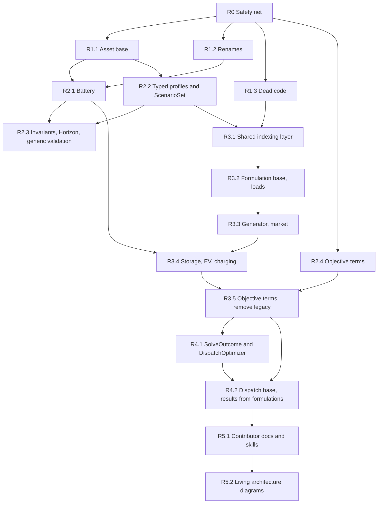

# Phase 4: Roadmap

How to move odys from the current model ([inventory](inventory.md)) to the [target model](target-model.md), following `ARCHITECTURE_REVIEW_METHODOLOGY.md` section 4. The steps are ordered by the [findings](findings.md) prioritization matrix and by dependency.

**Rule for every step:** it is one PR that can be merged on its own, and `just check` and `just test` are green after it (plus `just docs-build` when docs, examples or the public API change). No step loosens a test or a tool configuration. Breaking changes are listed in `CHANGELOG.md` in the same PR.

---

## 1. Overview

| Stage | Steps | Theme | Matrix phase |
| --- | --- | --- | --- |
| R0 | 1 | Safety net | prerequisite |
| R1 | 3 | Quick wins: F-10, F-02, F-18 | 1-2 |
| R2 | 4 | Domain model: F-03, F-08, F-09, F-11, F-20 | 2-3 |
| R3 | 5 | Model side: F-01, F-05, F-06, F-07, F-15, F-16, F-17 | 2-3 |
| R4 | 2 | Boundaries and results: F-04, F-12, F-13, F-14 | 2-3 |
| R5 | 2 | Documentation and diagram upkeep | none |

That is 17 PRs in total. R1 and R2.4 can proceed in parallel. R3 is a strangler migration: the builder supports migrated and legacy asset types side by side until R3.5 removes the legacy path.

---

## 2. Steps

### R0: Safety net (characterization tests)

| | |
| --- | --- |
| **Goal** | Pin current behaviour before refactoring. Solve every example configuration and every integration-test system, and assert objective value and key dispatch series against recorded values. Add the import-linter contracts from the target that already hold today. |
| **Findings** | none (enabler) |
| **Files** | new `tests/integration/test_characterization.py`; `pyproject.toml` (new `forbidden` contract: `domain` and `parameters` must not import `linopy`, with `include_external_packages = true`) |
| **Guarding tests** | the new characterization tests themselves, with tolerance via `pytest.approx` |
| **API impact** | none |
| **Risk** | low. Recorded values must come from the current code (after the `7c67484` timestep fix), not be hand-computed. |
| **Status** | Done (2026-10-01). - `tests/integration/test_characterization.py` pins the objective of all 6 examples (7 systems), loaded with `runpy` so the test imports no example module. - It adds two feature systems solved with `mip_rel_gap=0`: unit commitment, and half-hourly storage + flexible load + market. Removing any single generator, capacity or storage feature in them changes the optimum (checked by hand), so a broken constraint fails the test. - Integration-test systems are not pinned again, because their tests already assert the full dispatch. - New contracts: domain imports no `linopy`, `xarray`, `numpy` or `pandas`; parameters import no `linopy`. |

### R1.1: `Asset` base; portfolio accepts only assets

| | |
| --- | --- |
| **Goal** | Introduce abstract `Asset(EnergyEntity)` for the 6 user-owned entity types. `AssetPortfolio` is typed to `Asset` and raises `OdysValidationError` for anything else. Replace per-type properties with `assets_of(Type)` (checkpoint 3, decision 5). |
| **Findings** | F-10 |
| **Files** | `domain/entities/base.py`, the 6 asset entity modules, `portfolio.py`, `validation.py` and `energy_system.py` (call sites of the old properties), tests, `docs/user_guide/asset_portfolio.md` |
| **Guarding tests** | new: a market in the portfolio raises; `assets_of` returns only that type. Existing portfolio tests migrated to `assets_of`. |
| **API impact** | breaking: portfolio properties removed; markets are rejected |
| **Risk** | low |
| **Status** | Done (2026-10-01). `Asset` is exported in `__all__`. The runtime guard is tested through an untyped constructor reference (a fixture typed `Callable[..., AssetPortfolio]`), with no suppression. Fixed along the way: a portfolio built from a generator expression was silently empty (regression test added). Two EV integration tests passed the market both in the portfolio and in `markets=`; the redundant portfolio entry was removed, with no assertion changes. |

### R1.2: Public renames

| | |
| --- | --- |
| **Goal** | Apply all decided renames in one PR, so users migrate once: - `TradeDirection` → `AllowedTradeDirection`, `trade_direction` → `allowed_trade_direction`; - `StandaloneStorage` → `StationaryStorage`, including its parameters, constraints and dispatch classes, `results.stationary_storages`, and the dimension label `"stationary_storage"`; - `OptimalDisptachResults` → `OptimalDispatchResults`, now exported in `__all__`; - `MarketDispatch.net_volume` returns `pd.Series`. |
| **Findings** | F-18, F-14 (return type); checkpoint decisions |
| **Files** | `market.py`, `standalone_storage.py` (renamed), `__init__.py`, parameters, constraints, results modules; examples; `docs/` (user guide, API pages, `zensical.toml` nav); `AGENTS.md` |
| **Guarding tests** | the full suite plus R0 characterization. Tests are updated only by renaming, with no assertion changes. |
| **API impact** | breaking renames |
| **Risk** | low; mostly mechanical. `grep` for the old names must come back empty (except `CHANGELOG.md`). |
| **Status** | Done (2026-10-01). The `grep` for old names is empty outside `docs/architecture/` and `CHANGELOG.md`. The only changed assertion is the `net_volume` test: it now asserts `pd.Series` equal to sell − buy (stronger than the old type-only check). Protected files (`AGENTS.md`, the `add-asset` skill, the import-linter contract) were edited by hand. |

### R1.3: Remove dead code

| | |
| --- | --- |
| **Goal** | Delete `AssetRegistry`/`AssetSpec`, `Storage.asset_type()`, `ScenarioParameters.time_index`/`scenario_index`, the `AGENTS.md` instruction to keep the registry in sync, and `odys.utils` (`logging.py`: no callers; decided at checkpoint 4) with its API docs pages and nav entries. Check that `rich` is still needed (deptry ignores it as DEP004). |
| **Findings** | F-02, inventory 7.13 |
| **Files** | `optimization/model/registry.py`, `storage.py`, `standalone_storage.py`, `electric_vehicle.py`, `scenario_parameters.py`, `AGENTS.md`, `.claude/skills/add-asset/SKILL.md`, `src/odys/utils/`, `docs/api/utils/`, `zensical.toml`, `pyproject.toml` (deptry config for `rich`) |
| **Guarding tests** | the full suite (nothing may reference the removed code) |
| **API impact** | `odys.utils.logging` removed (never in `__all__`) |
| **Risk** | low |
| **Status** | Done (2026-10-01), except `Storage.asset_type()`, which **moves to R2.1**: it is `Storage`'s only abstract method, so removing it now would make `Storage` instantiable until R2.1 deletes the class. The examples now use the standard `logging` module, configured inside `if __name__ == "__main__":`, so loading them no longer changes global logging. The deptry DEP004 ignore and the `rich` dev dependency are removed. AGENTS.md now also states the new linopy/xarray import contracts. |

### R2.1: `Battery` value object

| | |
| --- | --- |
| **Goal** | Add frozen `Battery` (11 fields plus the SOC validators). `StationaryStorage(name, battery=...)` and `ElectricVehicle(name, battery=..., trips=...)` compose it, and the `Storage` base class is removed together with its `asset_type()` method (deferred from R1.3). Internals (parameters, validation) read `asset.battery.<field>`. The model side is unchanged in this step. |
| **Findings** | F-08 (domain half) |
| **Files** | new `domain/entities/battery.py`; `storage.py` (removed), `stationary_storage.py`, `electric_vehicle.py`, `__init__.py`; the two storage parameters classes; `validation.py`; tests; examples; `docs/user_guide/storage.md`, `electric_vehicle.py` docs |
| **Guarding tests** | the `Battery` validator tests (moved from the storage tests); R0 characterization unchanged |
| **API impact** | breaking constructor shape |
| **Risk** | medium: many test fixtures and examples change shape |

### R2.2: Typed profiles, one `Scenario`, `ScenarioSet`

| | |
| --- | --- |
| **Goal** | Add `Profile` (abstract, frozen) with `Demand(load, values)`, `AvailableCapacity(generator, values)` and `Price(market, values)`. `Scenario(name="base", probability=1.0, profiles=...)` absorbs `StochasticScenario`. `ScenarioSet` owns the probability-tolerance and unique-name rules. `EnergySystem` normalizes `scenarios` into a `ScenarioSet` and `markets` into a tuple **once**, at construction. `ScenarioParameters` reads the typed profiles. |
| **Findings** | F-09, F-20 |
| **Files** | `domain/scenarios.py` (split into `profiles.py`, `scenario.py`), `energy_system.py`, `validation.py` (profile-consistency functions rewritten against the typed profiles), `scenario_parameters.py`, `__init__.py`; tests; every example; `docs/user_guide/scenario.md`, `stochastic*.md`, and all examples pages |
| **Guarding tests** | new: a wrong entity type in a profile is rejected; duplicate profiles for the same entity and kind are rejected; a single `Scenario` normalizes to a one-element set. The existing profile-consistency tests are ported. R0 characterization unchanged. |
| **API impact** | breaking: scenario construction; `StochasticScenario` removed |
| **Risk** | **high**. This is the largest user-facing change, touching every example and most docs pages. Land it as its own release note section with a before/after snippet. |

### R2.3: Entity invariants, `Horizon`, generic validation

| | |
| --- | --- |
| **Goal** | Move the EV trip-overlap and departure-SOC checks into `ElectricVehicle` validators. Make "chargers if and only if EVs" an `AssetPortfolio` invariant. Add the `Horizon` value object. Add `required_profiles` and the capability queries `max_supply`, `min_demand` and `validate_horizon` on `EnergyEntity`. Rewrite `validation.py` as a few generic system rules that iterate entities. The side effect: EV discharge now counts as supply (a validation behaviour change, noted in CHANGELOG). |
| **Findings** | F-03 |
| **Files** | `base.py`, the entity modules, `portfolio.py`, new `domain/horizon.py`, `validation.py` (≈600 → ≈150 lines), `energy_system.py`; tests |
| **Guarding tests** | the existing validation tests are kept as behaviour specs (same inputs, same `OdysValidationError` messages where possible). New: errors are raised at entity construction. |
| **API impact** | errors are raised earlier; the sufficiency check becomes less strict for EV fleets |
| **Risk** | medium. Error messages may change, so tests that `match=` on messages need care, without loosening what they assert. |

### R2.4: `Objective` as a tuple of terms

| | |
| --- | --- |
| **Goal** | `Objective(terms=(ProfitTerm(...), CVaRTerm(...)))`, frozen, with a validator for at most one term per type and a profit term required. `build_objective` iterates the terms (temporary `match` on the term type until R3.5). |
| **Findings** | F-11 (domain half) |
| **Files** | `domain/objective.py`, `optimization/model/objectives.py`, `model_builder.py` (CVaR presence check), tests, `docs/user_guide/optimization.md`, the CVaR example |
| **Guarding tests** | the CVaR integration tests plus R0 |
| **API impact** | breaking: `Objective` construction |
| **Risk** | low |

### R3.1: Shared indexing layer

| | |
| --- | --- |
| **Goal** | Move `ModelDimension` (reduced to `Scenario` and `Time` once R3.5 lands; asset members stay until then) and coordinates into `parameters/`, plus `ModelContext` (time and scenario coordinates, Δt, probabilities, `profiles(kind, entities, dimension)`). Add a generic `vectorize(entities, fields, dimension)` that replaces the hand-written properties of the `*Parameters` classes with unchanged field names. `ModelContext.time` becomes the only source of `str(t)` labels. |
| **Findings** | F-15, F-17 |
| **Files** | new `parameters/dimensions.py`, `parameters/context.py`, `parameters/vectorize.py`; `optimization/model/dimensions.py`/`coordinates.py` (moved); all `*Parameters` classes; import updates across `optimization` and `results`; `pyproject.toml` contract "parameters must not import optimization" |
| **Guarding tests** | parameters tests; the unmasked-labels assertions in the constraint tests; R0 |
| **API impact** | none |
| **Risk** | medium: many import changes. The integer-versus-string time bug class is now tested in one place. |

### R3.2: `Formulation` base; migrate loads (strangler start)

| | |
| --- | --- |
| **Goal** | Add the `Formulation` base (extends `ConstraintGroup`; `add_variables`, `power_injection`, `profit`, `dispatch`), the `FORMULATIONS` tuple, `PowerBalance`, and `OptimizationProblem` (initially wrapping the legacy parameters). Migrate `FixedLoadFormulation` and `FlexibleLoadFormulation`, the smallest types and the current golden file. The builder adds migrated formulations generically and keeps legacy branches for the other types. Power balance and profit sum migrated contributions plus legacy terms. |
| **Findings** | F-01, F-05, F-06, F-07 (start) |
| **Files** | new `optimization/formulations/base.py`, `fixed_load.py`, `flexible_load.py`, `optimization/power_balance.py`, `optimization/problem.py`; `model_builder.py`, `scenario_constraints.py`, `milp_model.py` (legacy terms for migrated types removed); flexible-load constraint tests moved to formulation tests |
| **Guarding tests** | flexible-load unit tests (same `assert_conequal` expectations), flexible-load integration tests, R0 |
| **API impact** | none |
| **Risk** | medium: two paths coexist temporarily. The `AGENTS.md` golden-file table must point at the new formulation file. |

### R3.3: Migrate generator and market

| | |
| --- | --- |
| **Goal** | `GeneratorFormulation` (13 constraints, available capacity from `ModelContext` profiles; also vectorize min up/down time if it is simple, otherwise keep the per-generator loop and record it) and `EnergyMarketFormulation` (including non-anticipativity for `stage_fixed`, which moves out of `ScenarioConstraints`). |
| **Findings** | F-01, F-06, F-07 |
| **Files** | new `formulations/generator.py`, `formulations/energy_market.py`; removals in `constraints/`, `variable_definitions.py`, `milp_model.py`, `scenario_constraints.py`; tests moved |
| **Guarding tests** | generator and market constraint tests, scenario integration tests (anticipativity), R0 |
| **API impact** | none |
| **Risk** | medium |

### R3.4: Migrate storage, EV and charging

| | |
| --- | --- |
| **Goal** | `StorageFormulation` part (dimension plus optional SOC drop), composed by `StationaryStorageFormulation` and `ElectricVehicleFormulation`. `ChargingFormulation` takes the EV formulation in its constructor. `storage_constraints.py` free functions become `StorageFormulation` methods. |
| **Findings** | F-08 (model half), F-01, F-06 |
| **Files** | new `formulations/storage.py`, `stationary_storage.py`, `electric_vehicle.py`, `charging.py`; removals in `constraints/`; tests moved |
| **Guarding tests** | storage, EV and charger constraint tests; EV fleet integration tests; R0 |
| **API impact** | none |
| **Risk** | medium: the EV and charger coupling is the most intricate part of the model |

### R3.5: Objective term formulations; remove the legacy path

| | |
| --- | --- |
| **Goal** | Add `ProfitTermFormulation` and `CVaRTermFormulation` plus `OBJECTIVE_TERM_FORMULATIONS`. `OptimizationProblem.assemble(...)` replaces `EnergySystem.build_parameters()`. Delete `EnergyMILPModel`, `VariableStore`, `VariableDefinitionRegistry`, `CoordinatesStore`, `EnergySystemParameters`, `ScenarioConstraints`, `CVaRConstraints` and the legacy builder branches. `ModelDimension` is reduced to `Scenario` and `Time`. Replace the temporary `_SUPPORTED_ASSET_TYPES` check in `validation.py` (added in R1.1 review) with "no formulation for this type" raised by `OptimizationProblem.assemble`. |
| **Findings** | F-01, F-05, F-07, F-11, F-16 |
| **Files** | new `optimization/objective_terms/`; `problem.py`, `model_builder.py`, `energy_system.py`; many deletions; `optimization/CLAUDE.md`, `.claude/skills/new-constraint`, `.claude/skills/add-asset` |
| **Guarding tests** | full suite; R0; the CVaR tests |
| **API impact** | `EnergySystem.build_parameters()` removed |
| **Risk** | medium. After this step, re-run the T1 trace: adding a dummy asset type in a scratch branch should touch the 5 files predicted by the target model. |

### R4.1: `SolveOutcome` and `DispatchOptimizer`

| | |
| --- | --- |
| **Goal** | `solvers.solve(model, config) -> SolveOutcome` with an odys `SolveStatus` enum. The solver stops importing `results`. `DispatchOptimizer` in the composition root runs assemble → build → solve → results. `EnergySystem.optimize()` becomes a one-line façade. |
| **Findings** | F-04, F-12 (containment), F-13 |
| **Files** | `solvers/solver.py`, new `solvers/outcome.py`, new `odys/optimizer.py` (or inside `energy_system.py`), `results/optimization_results.py`; `pyproject.toml` contract "solvers must not import results" |
| **Guarding tests** | solver tests; results status tests updated to `SolveStatus` |
| **API impact** | `results.solver_status` type changes to `SolveStatus` |
| **Risk** | low |

### R4.2: `Dispatch` base; results built by formulations

| | |
| --- | --- |
| **Goal** | Add the `Dispatch` base, which implements the container protocol once over `self.dimension`. The seven dispatch subclasses declare only their series. Each formulation implements `dispatch(solution)`. `OptimalDispatchResults.from_outcome(outcome, problem)` collects them and squeezes the scenario dimension once. `results` no longer imports `optimization` or `linopy`. Flip the contract so that `optimization` may import `results` but not the reverse, and add `linopy` to the `results` forbidden list. |
| **Findings** | F-13, F-14, F-12 |
| **Files** | `results/dispatch.py` (≈460 → ≈200 lines), `results/optimization_results.py`, all formulations, `pyproject.toml` |
| **Guarding tests** | `test_dispatch.py`, `test_optimization_results.py`, R0 (dispatch series) |
| **API impact** | none beyond R1.2 and R4.1 |
| **Risk** | low |

### R5.1: Contributor docs and skills

| | |
| --- | --- |
| **Goal** | Update the contributor docs to the new structure: - `AGENTS.md` sections "Architecture Flow", "Adding a new asset type" (now 5 files) and the golden files; - `src/odys/*/CLAUDE.md`; - the `add-asset` and `new-constraint` skills and the `python-reviewer` checklist; - the user guide pages whose examples changed. |
| **Findings** | none (documentation) |
| **Files** | `AGENTS.md`, `CLAUDE.md` files, `.claude/skills/*`, `.claude/agents/python-reviewer.md`, `docs/` |
| **Guarding tests** | `just docs-build`; a dry run of the `add-asset` skill on a scratch branch |
| **API impact** | none |
| **Risk** | low. These files are protected by the guard hook, so each edit asks for approval. |

### R5.2: Living architecture diagrams (deferred decision)

| | |
| --- | --- |
| **Goal** | Decide how the UML stays true to the code, per methodology section 4: - **Where:** one explanation page, `docs/architecture/model.md`, with the target-model diagrams updated to the implemented state. The review documents (inventory, findings, target model, roadmap) stay as history. - **How:** diagrams stay hand-written Mermaid (curated, readable). - **Drift check:** a test parses the class names in the Mermaid blocks and compares them with the classes defined in `src/odys` (via `ast`), so adding or removing a class without updating the diagram fails CI. |
| **Findings** | methodology Phase 4 requirement |
| **Files** | new `docs/architecture/model.md`, new `tests/test_architecture_docs.py`, `zensical.toml` |
| **Guarding tests** | the drift test itself |
| **API impact** | none |
| **Risk** | low. Decide the exact scope (all classes, or public and core model classes only) when R4 is done. |

---

## 3. Backlog (not scheduled)

| Item | Trigger |
| --- | --- |
| `Market` base class and `ReserveProvider` capability protocol | when a second market product (such as reserves) is planned; target model T2a |
| `Charger.efficiency` losses model | when charger losses matter; the field is a TODO today (`7c67484`) |
| Full modeling-layer abstraction over linopy | only if a second modeling layer is ever planned (F-12; rejected at checkpoint 2) |
| Vectorized min up/down time constraints | if R3.3 keeps the per-generator loop |

---

## 4. Public API migration summary

Breaking changes come from five PRs: R1.1 (portfolio), R1.2 (renames), R2.1 (`Battery`), R2.2 (scenarios and profiles), R2.4 (objective), plus `SolveStatus` in R4.1.

**Decided at checkpoint 4: one breaking release.** Every step still merges to `main` as its own PR, but nothing is published to PyPI until the last code step (R4.2) and R5.1 are merged. All breaking entries accumulate under `## [Unreleased]` in `CHANGELOG.md`, and that section gets a single "Migrating from 0.2" guide with before and after snippets, taken from the table in [target model](target-model.md) section 9. The release is **0.3.0**. R5.2 can follow after the release.

While the release is pending, `main` is not publishable, so a hotfix for 0.2.x needs a branch from the `v0.2.1` tag.

## 5. Checkpoint 4: questions for the user

1. Is the step order acceptable, in particular doing the **domain changes (R2) before the model-side rewrite (R3)**? The alternative is R3 first, which is internal only and has no user impact, but R3 then has to be written against the old `Scenario` and storage shapes and partly redone.
2. Do you agree with the **release grouping** in section 4, or do you prefer a single breaking release?
3. `utils.logging` has no callers in `src/` but has an API docs page. Is it public (keep it) or can R1.3 remove it?

---

## 6. Checkpoint 4 decisions

Recorded from the user's review (2026-10-01). This completes the review (methodology section 9). Implementation is a separate task.

1. **Order:** the domain changes (R2) come before the model-side rewrite (R3), as proposed.
2. **Release:** a single breaking release (0.3.0) containing everything up to R5.1 (section 4).
3. **`utils.logging`:** removed in R1.3.
