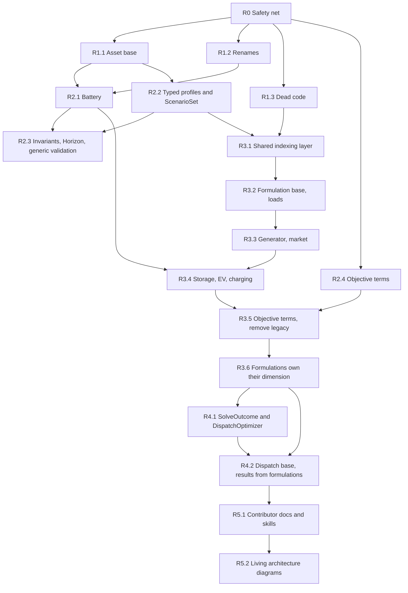

# Phase 4: Roadmap

How to move odys from the current model ([inventory](inventory.md)) to the [target model](target-model.md), following `ARCHITECTURE_REVIEW_METHODOLOGY.md` section 4. The steps are ordered by the [findings](findings.md) prioritization matrix and by dependency.

**Rule for every step:** it is one PR that can be merged on its own, and `just check` and `just test` are green after it (plus `just docs-build` when docs, examples or the public API change). No step loosens a test or a tool configuration. Breaking changes are listed in `CHANGELOG.md` in the same PR.

---

## 1. Overview

| Stage | Steps | Theme | Matrix phase |
| --- | --- | --- | --- |
| R0 | 1 | Safety net | prerequisite |
| R1 | 3 | Quick wins: F-10, F-02, F-18 | 1-2 |
| R2 | 4 | Domain model: F-03, F-08, F-09, F-11, F-20 | 2-3 |
| R3 | 6 | Model side: F-01, F-05, F-06, F-07, F-15, F-16, F-17 | 2-3 |
| R4 | 2 | Boundaries and results: F-04, F-12, F-13, F-14 | 2-3 |
| R5 | 2 | Documentation and diagram upkeep | none |

That is 18 PRs in total (R3.6 was split out of R3.5 on 2026-10-04). R1 and R2.4 can proceed in parallel. R3 is a strangler migration: the builder supports migrated and legacy asset types side by side until R3.5 removes the legacy path; R3.6 then moves the per-type dimensions into the formulations.

---

## 2. Steps

### R0: Safety net (characterization tests)

| | |
| --- | --- |
| **Goal** | Pin current behaviour before refactoring. Solve every example configuration and every integration-test system, and assert objective value and key dispatch series against recorded values. Add the import-linter contracts from the target that already hold today. |
| **Findings** | none (enabler) |
| **Files** | new `tests/integration/test_characterization.py`; `pyproject.toml` (new `forbidden` contract: `domain` and `parameters` must not import `linopy`, with `include_external_packages = true`) |
| **Guarding tests** | the new characterization tests themselves, with tolerance via `pytest.approx` |
| **API impact** | none |
| **Risk** | low. Recorded values must come from the current code (after the `7c67484` timestep fix), not be hand-computed. |
| **Status** | Done (2026-10-01). - `tests/integration/test_characterization.py` pins the objective of all 6 examples (7 systems), loaded with `runpy` so the test imports no example module. - It adds two feature systems solved with `mip_rel_gap=0`: unit commitment, and half-hourly storage + flexible load + market. Removing any single generator, capacity or storage feature in them changes the optimum (checked by hand), so a broken constraint fails the test. - Integration-test systems are not pinned again, because their tests already assert the full dispatch. - New contracts: domain imports no `linopy`, `xarray`, `numpy` or `pandas`; parameters import no `linopy`. |

### R1.1: `Asset` base; portfolio accepts only assets

| | |
| --- | --- |
| **Goal** | Introduce abstract `Asset(EnergyEntity)` for the 6 user-owned entity types. `AssetPortfolio` is typed to `Asset` and raises `OdysValidationError` for anything else. Replace per-type properties with `assets_of(Type)` (checkpoint 3, decision 5). |
| **Findings** | F-10 |
| **Files** | `domain/entities/base.py`, the 6 asset entity modules, `portfolio.py`, `validation.py` and `energy_system.py` (call sites of the old properties), tests, `docs/user_guide/asset_portfolio.md` |
| **Guarding tests** | new: a market in the portfolio raises; `assets_of` returns only that type. Existing portfolio tests migrated to `assets_of`. |
| **API impact** | breaking: portfolio properties removed; markets are rejected |
| **Risk** | low |
| **Status** | Done (2026-10-01). `Asset` is exported in `__all__`. The runtime guard is tested through an untyped constructor reference (a fixture typed `Callable[..., AssetPortfolio]`), with no suppression. Fixed along the way: a portfolio built from a generator expression was silently empty (regression test added). Two EV integration tests passed the market both in the portfolio and in `markets=`; the redundant portfolio entry was removed, with no assertion changes. |

### R1.2: Public renames

| | |
| --- | --- |
| **Goal** | Apply all decided renames in one PR, so users migrate once: - `TradeDirection` → `AllowedTradeDirection`, `trade_direction` → `allowed_trade_direction`; - `StandaloneStorage` → `StationaryStorage`, including its parameters, constraints and dispatch classes, `results.stationary_storages`, and the dimension label `"stationary_storage"`; - `OptimalDisptachResults` → `OptimalDispatchResults`, now exported in `__all__`; - `MarketDispatch.net_volume` returns `pd.Series`. |
| **Findings** | F-18, F-14 (return type); checkpoint decisions |
| **Files** | `market.py`, `standalone_storage.py` (renamed), `__init__.py`, parameters, constraints, results modules; examples; `docs/` (user guide, API pages, `zensical.toml` nav); `AGENTS.md` |
| **Guarding tests** | the full suite plus R0 characterization. Tests are updated only by renaming, with no assertion changes. |
| **API impact** | breaking renames |
| **Risk** | low; mostly mechanical. `grep` for the old names must come back empty (except `CHANGELOG.md`). |
| **Status** | Done (2026-10-01). The `grep` for old names is empty outside `docs/architecture/` and `CHANGELOG.md`. The only changed assertion is the `net_volume` test: it now asserts `pd.Series` equal to sell − buy (stronger than the old type-only check). Protected files (`AGENTS.md`, the `add-asset` skill, the import-linter contract) were edited by hand. |

### R1.3: Remove dead code

| | |
| --- | --- |
| **Goal** | Delete `AssetRegistry`/`AssetSpec`, `Storage.asset_type()`, `ScenarioParameters.time_index`/`scenario_index`, the `AGENTS.md` instruction to keep the registry in sync, and `odys.utils` (`logging.py`: no callers; decided at checkpoint 4) with its API docs pages and nav entries. Check that `rich` is still needed (deptry ignores it as DEP004). |
| **Findings** | F-02, inventory 7.13 |
| **Files** | `optimization/model/registry.py`, `storage.py`, `standalone_storage.py`, `electric_vehicle.py`, `scenario_parameters.py`, `AGENTS.md`, `.claude/skills/add-asset/SKILL.md`, `src/odys/utils/`, `docs/api/utils/`, `zensical.toml`, `pyproject.toml` (deptry config for `rich`) |
| **Guarding tests** | the full suite (nothing may reference the removed code) |
| **API impact** | `odys.utils.logging` removed (never in `__all__`) |
| **Risk** | low |
| **Status** | Done (2026-10-01), except `Storage.asset_type()`, which **moves to R2.1**: it is `Storage`'s only abstract method, so removing it now would make `Storage` instantiable until R2.1 deletes the class. The examples now use the standard `logging` module, configured inside `if __name__ == "__main__":`, so loading them no longer changes global logging. The deptry DEP004 ignore and the `rich` dev dependency are removed. AGENTS.md now also states the new linopy/xarray import contracts. |

### R2.1: `Battery` value object

| | |
| --- | --- |
| **Goal** | Add frozen `Battery` (11 fields plus the SOC validators). `StationaryStorage(name, battery=...)` and `ElectricVehicle(name, battery=..., trips=...)` compose it, and the `Storage` base class is removed together with its `asset_type()` method (deferred from R1.3). Internals (parameters, validation) read `asset.battery.<field>`. The model side is unchanged in this step. |
| **Findings** | F-08 (domain half) |
| **Files** | new `domain/entities/battery.py`; `storage.py` (removed), `stationary_storage.py`, `electric_vehicle.py`, `__init__.py`; the two storage parameters classes; `validation.py`; tests; examples; `docs/user_guide/storage.md`, `electric_vehicle.py` docs |
| **Guarding tests** | the `Battery` validator tests (moved from the storage tests); R0 characterization unchanged |
| **API impact** | breaking constructor shape |
| **Risk** | medium: many test fixtures and examples change shape |
| **Status** | Done (2026-10-01). `Battery` is exported in `__all__`. About 40 test and example call sites were rewritten by an AST script that moves the battery keyword arguments into `battery=Battery(...)` (none skipped). The field and SOC validator tests moved one-for-one to `test_battery.py`. New tests: battery frozen, no `name` on a battery, flat battery fields rejected on `StationaryStorage`, battery required. Characterization objectives unchanged. `python-reviewer`: no must-fix. |

### R2.2: Typed profiles, one `Scenario`, `ScenarioSet`

| | |
| --- | --- |
| **Goal** | Add `Profile` (abstract, frozen) with `Demand(load, values)`, `AvailableCapacity(generator, values)` and `Price(market, values)`. `Scenario(name="base", probability=1.0, profiles=...)` absorbs `StochasticScenario`. `ScenarioSet` owns the probability-tolerance and unique-name rules. `EnergySystem` normalizes `scenarios` into a `ScenarioSet` and `markets` into a tuple **once**, at construction. `ScenarioParameters` reads the typed profiles. |
| **Findings** | F-09, F-20 |
| **Files** | `domain/scenarios.py` (split into `profiles.py`, `scenario.py`), `energy_system.py`, `validation.py` (profile-consistency functions rewritten against the typed profiles), `scenario_parameters.py`, `__init__.py`; tests; every example; `docs/user_guide/scenario.md`, `stochastic*.md`, and all examples pages |
| **Guarding tests** | new: a wrong entity type in a profile is rejected; duplicate profiles for the same entity and kind are rejected; a single `Scenario` normalizes to a one-element set. The existing profile-consistency tests are ported. R0 characterization unchanged. |
| **API impact** | breaking: scenario construction; `StochasticScenario` removed |
| **Risk** | **high**. This is the largest user-facing change, touching every example and most docs pages. Land it as its own release note section with a before/after snippet. |
| **Status** | Done (2026-10-03). - `Demand`, `AvailableCapacity` and `Price` are exported; `Profile` and `ScenarioSet` stay internal for now (users never build them). - `EnergySystem` normalizes once through `cached_property` (`scenario_set`, `collection_of_markets`), because `ty` rejects assigning private attributes on a frozen model. - `validation.py` reads the typed profiles through small name-keyed helpers, so every existing message is unchanged; the generic rewrite stays in R2.3. New rule: a profile must reference the system's entity of that name. - The "capacity only for generators" error is now mostly a construction-time type error; the remaining name-clash case is tested at both levels. - Tests that used `{}` to mean "missing profile" now use two entities with one profile missing, asserting the missing name. - Behaviour change: a deterministic scenario's result label is `"base"` (was `"deterministic_scenario"`), in CHANGELOG. - Characterization objectives unchanged. - `python-reviewer` must-fix applied: the entity-match check looks markets and assets up in separate namespaces (a market may share a name with an asset), and runs before the name-keyed checks. Also applied: `Scenario.profiles` is typed as the closed union `Demand \| AvailableCapacity \| Price` so scenarios round-trip through `model_dump`, and a direct `ScenarioParameters` unit test was added. Deferred to R2.3: the name-keyed profile helpers are duplicated in `validation.py` and `scenario_parameters.py`. - Follow-up decision (2026-10-03): the profile classes are named `LoadProfile`, `AvailableCapacityProfile` and `PriceProfile` (industry terms, and no clash with variables such as `demand`). |

### R2.3: Entity invariants, `Horizon`, generic validation

| | |
| --- | --- |
| **Goal** | Move the EV trip-overlap and departure-SOC checks into `ElectricVehicle` validators. Make "chargers if and only if EVs" an `AssetPortfolio` invariant. Add the `Horizon` value object. Add `required_profiles` and the capability queries `max_supply`, `min_demand` and `validate_horizon` on `EnergyEntity`. Rewrite `validation.py` as a few generic system rules that iterate entities. The side effect: EV discharge now counts as supply (a validation behaviour change, noted in CHANGELOG). |
| **Findings** | F-03 |
| **Files** | `base.py`, the entity modules, `portfolio.py`, new `domain/horizon.py`, `validation.py` (≈600 → ≈150 lines), `energy_system.py`; tests |
| **Guarding tests** | the existing validation tests are kept as behaviour specs (same inputs, same `OdysValidationError` messages where possible). New: errors are raised at entity construction. |
| **API impact** | errors are raised earlier; the sufficiency check becomes less strict for EV fleets |
| **Risk** | medium. Error messages may change, so tests that `match=` on messages need care, without loosening what they assert. |
| **Status** | Done (2026-10-03). - New `domain/horizon.py` with `Horizon` and `OperatingConditions`; `EnergySystem.horizon` is a plain property (no stale cache after `model_copy`), so a non-positive timestep or zero steps is now rejected; `Horizon` and `OperatingConditions` stay unexported. - `ElectricVehicle` validates trip overlap and departure SOC at construction; `validate_horizon` replaces `validate_trips_within_horizon`. `AssetPortfolio` enforces chargers if and only if EVs. - Single-profile rules moved into profile validators: capacity within 0..`nominal_power`, flexible base ≥ `max_decrease`. - `EnergyEntity` has `max_supply`, `min_demand`, `max_energy_supply` (a fourth query, for battery energy) and `validate_horizon`; overridden by generator, storage, EV, market and the loads. - `validation.py` is seven generic rules (705 → 283 lines, most of it docstrings); the name-keyed helpers are gone, which also removes the duplication with `scenario_parameters.py` deferred from R2.2. - Deviations from target-model §3, recorded in §12 items 7 and 8: requirements are declared on the profile type (`entity_types`, `required`) because of the profiles → entities import; queries take one `OperatingConditions` argument because of ruff `ARG002` on Python 3.11. - Behaviour changes, in CHANGELOG: EV discharge counts as supply; demand is summed over all loads per timestep (was per load); price length is checked; battery energy is min(capacity, discharge power × horizon); messages for missing, extra and wrong-length profiles are reworded. Every old validation test case is kept with an equally strict `match=`, except the "unrelated flexible load name is skipped" cases, which the reference check now rejects up front. - `python-reviewer`: no must-fix. Applied: both `Horizon` errors use pydantic constraints and are tested through `EnergySystem`; tests that profile types cover disjoint entity types and that `entity_types` matches the entity field (the one-profile-per-entity assumption behind `profile_for`); `AnyProfile` union defined next to `PROFILE_TYPES`; the supply message names EV discharge; `validate_something_to_balance` renamed `validate_has_load_or_market`. Not applied: computing operating conditions once per scenario for both sums (cheap; measured about 1 s for 200 loads × 8760 steps × 10 scenarios). - Characterization objectives unchanged. |

### R2.4: `Objective` as a tuple of terms

| | |
| --- | --- |
| **Goal** | `Objective(terms=(ProfitTerm(...), CVaRTerm(...)))`, frozen, with a validator for at most one term per type and a profit term required. `build_objective` iterates the terms (temporary `match` on the term type until R3.5). |
| **Findings** | F-11 (domain half) |
| **Files** | `domain/objective.py`, `optimization/model/objectives.py`, `model_builder.py` (CVaR presence check), tests, `docs/user_guide/optimization.md`, the CVaR example |
| **Guarding tests** | the CVaR integration tests plus R0 |
| **API impact** | breaking: `Objective` construction |
| **Risk** | low |
| **Status** | Done (2026-10-03). - `Objective(terms=(ProfitTerm(...), CVaRTerm(...)))`, frozen, `terms: tuple[ProfitTerm \| CVaRTerm, ...]` (a closed union, so objectives round-trip through `model_dump`). Validators: at most one term per type, a `ProfitTerm` required. `Objective()` defaults to `(ProfitTerm(weight=1.0),)`; `term_of(kind)` reads a term back. - `EnergySystem.objective` defaults to `Objective()` (no longer `None`), which removes the default-building branch in `build_parameters`. - `build_objective` sums `weight * term` over the terms with a `match` on the term type and `assert_never`; the model builder asks `term_of(CVaRTerm)` for the CVaR variables and constraints. - New tests: validators, defaults, round-trip, and an integration test that term order does not change the optimum. - `python-reviewer`: no must-fix. Applied: the one-term-per-type check uses `isinstance` like `term_of`, so a `ProfitTerm` subclass next to a `ProfitTerm` is rejected (tested); clearer test names and matches; `build_objective` docstring notes that terms are never empty. Characterization (including the CVaR example objectives) unchanged. |

### R3.1: Shared indexing layer

| | |
| --- | --- |
| **Goal** | Move `ModelDimension` (reduced to `Scenario` and `Time` once R3.5 lands; asset members stay until then) and coordinates into `parameters/`, plus `ModelContext` (time and scenario coordinates, Δt, probabilities, `profiles(kind, entities, dimension)`). Add a generic `vectorize(entities, fields, dimension)` that replaces the hand-written properties of the `*Parameters` classes with unchanged field names. `ModelContext.time` becomes the only source of `str(t)` labels. |
| **Findings** | F-15, F-17 |
| **Files** | new `parameters/dimensions.py`, `parameters/context.py`, `parameters/vectorize.py`; `optimization/model/dimensions.py`/`coordinates.py` (moved); all `*Parameters` classes; import updates across `optimization` and `results`; `pyproject.toml` contract "parameters must not import optimization" |
| **Guarding tests** | parameters tests; the unmasked-labels assertions in the constraint tests; R0 |
| **API impact** | none |
| **Risk** | medium: many import changes. The integer-versus-string time bug class is now tested in one place. |
| **Status** | Done (2026-10-03). - `parameters/dimensions.py` (moved; adds `FixedLoads`, used only to sum fixed-load profiles), `parameters/coordinates.py` (`Coordinates(dimension, labels)`, `of_entities`; `CoordinatesStore` and `ModelCoordinates` deleted), `parameters/context.py` (`ModelContext`: `time`, `scenarios`, `timestep_hours`, `probabilities`, `coordinates_of`, `profiles(kind, entities, dimension, default=)`), `parameters/vectorize.py` and `parameters/entity_arrays.py`. - `ModelContext.time` is the only producer of `str(t)` labels; EV trip arrays take theirs from it. `timestep / timedelta(hours=1)` is no longer recomputed in the model. - Decision (user): entity parameters stay **typed**. Each type declares an `EntityArrays` subclass with one `xr.DataArray` field per domain field the model reads, named exactly like it, and `vectorize` fills it, so the six hand-written `*Parameters` classes are gone (about 300 lines). The plan said `NamedTuple`; a pydantic model was used because `vectorize` can construct it with `model_validate` for a generic `type[T]`, which a `NamedTuple` cannot do in a typed way. Renames that drifted are undone: `ramp_up`, `ramp_down`, `max_trading_volume_per_step`. EV arrays are `battery: BatteryArrays` plus derived `trips`. `Charger.efficiency` is no longer vectorized, since no constraint reads it (known issue). - `ScenarioParameters` stays (R3.2 dissolves it) but reads profiles through `context.profiles`, matching entities by identity; its name-keyed helpers are gone. - `python-reviewer`: no must-fix. Applied: `vectorize` turns an unset optional field (`None`) into `NaN`, so `ramp_up`, `ramp_down` and `soc_end` are float arrays instead of object arrays (tested); `build_parameters` builds each entity's `Coordinates` once and passes the same object to the context and to `vectorize` (EV arrays included); `ModelContext` rejects duplicate or time/scenario entity coordinates and caches its lookup; `vectorize` is bound to `EntityArrays`. Left for R3.2: `ScenarioParameters` still reads entities from the portfolio itself. - Import-linter: "Parameters do not import optimization" replaces the per-module list, so the `parameters ⇄ optimization.model` cycle is gone. - Characterization objectives unchanged. |

### R3.2: `Formulation` base; migrate loads (strangler start)

| | |
| --- | --- |
| **Goal** | Add the `Formulation` base (extends `ConstraintGroup`; `add_variables`, `power_injection`, `profit`, `dispatch`), the `FORMULATIONS` tuple, `PowerBalance`, and `OptimizationProblem` (initially wrapping the legacy parameters). Migrate `FixedLoadFormulation` and `FlexibleLoadFormulation`, the smallest types and the current golden file. The builder adds migrated formulations generically and keeps legacy branches for the other types. Power balance and profit sum migrated contributions plus legacy terms. |
| **Findings** | F-01, F-05, F-06, F-07 (start) |
| **Files** | new `optimization/formulations/base.py`, `fixed_load.py`, `flexible_load.py`, `optimization/power_balance.py`, `optimization/problem.py`; `model_builder.py`, `scenario_constraints.py`, `milp_model.py` (legacy terms for migrated types removed); flexible-load constraint tests moved to formulation tests |
| **Guarding tests** | flexible-load unit tests (same `assert_conequal` expectations), flexible-load integration tests, R0 |
| **API impact** | none |
| **Risk** | medium: two paths coexist temporarily. The `AGENTS.md` golden-file table must point at the new formulation file. |
| **Status** | Done (2026-10-04). - `optimization/formulations/`: `Formulation(ConstraintGroup, ABC)` with `build(entities, context)` (returns `None` when the system has no entity of the type, so absent types are never instantiated), `add_variables`, inherited `@constraint` discovery, `power_injection()` and `profit()`; `FixedLoadFormulation` (no variables, injection = minus summed demand) and `FlexibleLoadFormulation` (`FlexibleLoadVariables(load_adjustment)`, the two bound constraints, injection, value of consumption); `FORMULATIONS` lists them. - `OptimizationProblem` (`optimization/problem.py`) holds the legacy `EnergySystemParameters` and the formulations, with `formulation_of(Type)`. Decision (user): `EnergySystem.build_parameters()` is replaced by `build_problem()`, and `build_model(problem)`. - `PowerBalance` (`optimization/power_balance.py`) sums legacy injections and every `power_injection()`; it builds the constraint with `to_constraint("=", 0)`, so the `# type: ignore` on the old `== 0` is gone. Variable and constant injections are summed separately, since `DataArray + LinearExpression` is not a linopy expression. `ScenarioConstraints` keeps available capacity and non-anticipativity. - Variable and constraint order in the model is unchanged (formulations are added where flexible loads were), and the `load_adjustment` name is kept, so the solution and results are identical. - Removed: `FlexibleLoadConstraints`, `FLEXIBLE_LOAD_VARIABLES`, `VariableDefinitionRegistry.LOAD_ADJUSTMENT`, `VariableStore.load_adjustment`, `EnergySystemParameters.flexible_loads`, `ScenarioParameters.fixed_load_profiles` / `flexible_load_base_profiles`, and the builder's flexible-load branches. - Decision (user): `dispatch()` is deferred to R4.2. Until then `OptimalDispatchResults` takes the problem and reads the base profiles from `FlexibleLoadFormulation`. - Deviation: `per_scenario_profit()` stays on `EnergyMILPModel` (it needs the legacy variables) and adds every formulation's `profit()`; it moves to the problem in R3.5. The flexible-load profit term now comes last in the sum, which changes no value. - `python-reviewer` must-fix applied: a formulation keeps the variables of the model it is built into, so building one problem into two models would silently share variables; `add_variables` now refuses a second call and `OptimizationProblem` documents one model per problem (tested). Also applied: `power_injection()` never returns `None` (no user yet) and `PowerBalance` dispatches on its type with `match`; results decide flexible-load presence from the formulation only; `params` renamed `arrays`. Not applied: a generic `build` on the base (a `ClassVar` of a `TypeVar` is not allowed, and an untyped one would let `cls(entities)` pass any entity); each `build` is two lines. Stateless formulations (variables held by the model) are left for R3.5. - Characterization objectives, the power-balance `assert_conequal` test and the flexible-load constraint expectations are unchanged. |

### R3.3: Migrate generator and market

| | |
| --- | --- |
| **Goal** | `GeneratorFormulation` (13 constraints, available capacity from `ModelContext` profiles; also vectorize min up/down time if it is simple, otherwise keep the per-generator loop and record it) and `EnergyMarketFormulation` (including non-anticipativity for `stage_fixed`, which moves out of `ScenarioConstraints`). |
| **Findings** | F-01, F-06, F-07 |
| **Files** | new `formulations/generator.py`, `formulations/energy_market.py`; removals in `constraints/`, `variable_definitions.py`, `milp_model.py`, `scenario_constraints.py`; tests moved |
| **Guarding tests** | generator and market constraint tests, scenario integration tests (anticipativity), R0 |
| **API impact** | none |
| **Risk** | medium |
| **Status** | Done (2026-10-04). - `VariableFormulation[VariablesT]` lifts the typed-variables pattern into the base (three users): `_create_variables`, the `variables` accessor and the one-problem-one-model guard. `FlexibleLoadFormulation` moved onto it. - `GeneratorFormulation` (13 constraints plus `available_capacity_constraint`, profiles from `context.profiles` with an infinite default) and `EnergyMarketFormulation` (volume, exclusivity and direction constraints plus non-anticipativity for `stage_fixed`). Linopy variable and constraint names are unchanged; the names are `ClassVar` constants that results read. - Min up/down time keeps the per-generator loop: the rolling window differs per generator, which xarray cannot vectorize simply (backlog). - Removed: `GeneratorConstraints`, `MarketConstraints`, `ScenarioConstraints`, `ScenarioParameters` (and the `entity_parameters` package), the generator and market registry entries, `VariableStore` fields and builder branches, and `EnergySystemParameters.generators` / `.markets` / `.scenarios`. The market profit is rewritten as `sell·Δt·price - buy·Δt·price`, so the old `# pyrefly: ignore` did not come along. - Formulations now come first in the model (variables, constraints and power balance), then the legacy storage, EV and charger types. `assert_conequal` is order-sensitive; with this order the power-balance expectation is unchanged. - Decision (user): the reorder changed HiGHS's tie-break in `TestEvFleetWithSolar::test_maximize_self_consumption`, whose optimum was degenerate (objective −2400 whether the EV charges or not, verified by forcing the final SOC). The test now gives the EV a `soc_end` of 0.8 and also asserts the backup generator runs only when solar cannot cover the load ([30, 0, 0, 0, 30]), a unique optimum; the old `final_soc > 0.2` assertion is kept. - Deviation: the available-capacity, non-anticipativity and power-balance tests stay together in `test_system_constraints.py` (they share a mixed system fixture), and the profile tests in `formulations/test_formulation_profiles.py`, instead of being split per formulation. - `python-reviewer`: moved math verified identical against the deleted files (constraints, bounds, binaries, profit and injection terms; no masked labels). Applied: dimension names through `ModelDimension` instead of `time=`/`generator=` keywords, `to_constraint("=", 0)` instead of `== 0`, docstrings on every constraint (and a corrected status-constraint docstring), masked-label assertions on the available-capacity and non-anticipativity tests, test classes renamed away from deleted classes. Kept on purpose: the `FORMULATIONS` order test, as a guard on the power-balance order. - Characterization objectives unchanged. |

### R3.4: Migrate storage, EV and charging

| | |
| --- | --- |
| **Goal** | `StorageFormulation` part (dimension plus optional SOC drop), composed by `StationaryStorageFormulation` and `ElectricVehicleFormulation`. `ChargingFormulation` takes the EV formulation in its constructor. `storage_constraints.py` free functions become `StorageFormulation` methods. |
| **Findings** | F-08 (model half), F-01, F-06 |
| **Files** | new `formulations/storage.py`, `stationary_storage.py`, `electric_vehicle.py`, `charging.py`; removals in `constraints/`; tests moved |
| **Guarding tests** | storage, EV and charger constraint tests; EV fleet integration tests; R0 |
| **API impact** | none |
| **Risk** | medium: the EV and charger coupling is the most intricate part of the model |
| **Status** | Done (2026-10-04). - `formulations/storage.py`: `StorageFormulation`, a stateless reusable part (coordinates, `BatteryArrays`, context, optional SOC drop). It creates `StorageVariables` and has one method per former `storage_constraints.py` function, taking the variables as an argument; names are prefixed with the dimension (`stationary_storage_`, `ev_`), so the prefix needs no extra parameter. The two `# noqa: PLR0913` and the `# pyrefly: ignore` of the old free functions are gone. - `StationaryStorageFormulation` and `ElectricVehicleFormulation` compose it and delegate their battery constraints in the old order; the EV adds the driving and departure-SOC constraints and exposes its trips. `ChargingFormulation` receives the `ElectricVehicleFormulation`; its `power_injection()` returns `None` (outside the balance), so that option is back on the base with a real user. - Deviation: instead of assembling charging by hand after the loop, `build` takes one `FormulationInputs` argument (entities, context, formulations built so far, with `of_type` and `formulation_of`). Charging joins `FORMULATIONS` after EVs and finds the EV formulation itself, so there is no special case; a second `build` argument would have been unused in six of the seven formulations (ruff `ARG003`). - `FORMULATIONS` puts storage and EVs right after the loads, so variable, constraint and power-balance order are unchanged from before (no tie-break change this time). - No legacy asset code remains: the storage, EV and charger groups, registry entries, `VariableStore` fields and builder branches, `PowerBalance`'s legacy injections and `EnergySystemParameters`' asset fields are gone; only `context` and `objective` remain there. `per_scenario_profit` moved to `OptimizationProblem` (resolving R3.2's deviation), without the old `cast`. - Import-linter: the independence contract now lists all seven formulation modules, with one explicit `ignore_imports` entry for `charging -> electric_vehicle`, the intended coupling. - Only CVaR is still legacy (registry variables and `CVaRConstraints`), as planned for R3.5. - `python-reviewer`: moved math verified identical term by term against the deleted files. Applied: `ModelContext.variable_coords(*coordinates)` replaces the duplicated scenario/time/entity coordinate building (base, storage, charging); storage and EV name constants are derived from `ModelDimension` values (tested); stale docstrings fixed (`PowerBalance`, `EnergySystemParameters`, `EnergyMILPModel`, `VariableStore`); `assert_never` on the injection `match`; `!=` instead of a lexicographic `>` on time labels. - **Fixed (2026-10-04), as a separate test-first change:** the SOC-start constraint added the trip energy of a trip departing at t=0 instead of subtracting it (an EV at 0.5 SOC making a 5 MWh trip at t=0 on a 50 MWh battery ended the step at 0.6 instead of 0.4). The bug came from the old `storage_constraints.py`. Failing tests first: `test_soc_start_draws_the_energy_of_a_trip_departing_at_t0` (unit, constraint right-hand side) and `TestEvTripAtFirstStep` (integration, solved SOC); `test_constraint_ev_soc_start_without_a_trip_at_t0_is_soc_start` now asserts values instead of only the type. Fix: one sign in `StorageFormulation.soc_start_constraint`. Follow-up done: `ElectricVehicle` now rejects a trip departing at t=0 whose energy exceeds the starting charge above `soc_min` (a necessary condition; self-discharge only lowers the charge further), so such a model fails at construction with a clear message instead of being infeasible. - Characterization objectives, the moved `assert_conequal` expectations and the EV-fleet integration tests are unchanged. |

### R3.5: Objective term formulations; remove the legacy path

| | |
| --- | --- |
| **Goal** | Add `ProfitTermFormulation` and `CVaRTermFormulation` plus `OBJECTIVE_TERM_FORMULATIONS`. `OptimizationProblem.assemble(...)` replaces `EnergySystem.build_parameters()`. Delete `EnergyMILPModel`, `VariableStore`, `VariableDefinitionRegistry`, `CoordinatesStore`, `EnergySystemParameters`, `ScenarioConstraints`, `CVaRConstraints` and the legacy builder branches. ~~`ModelDimension` is reduced to `Scenario` and `Time`; replace `_SUPPORTED_ASSET_TYPES`~~ (moved to R3.6). |
| **Findings** | F-01, F-05, F-07, F-11, F-16 |
| **Files** | new `optimization/objective_terms/`; `problem.py`, `model_builder.py`, `energy_system.py`; many deletions; `optimization/CLAUDE.md`, `.claude/skills/new-constraint`, `.claude/skills/add-asset` |
| **Guarding tests** | full suite; R0; the CVaR tests |
| **API impact** | `EnergySystem.build_parameters()` removed |
| **Risk** | medium. After R3.6, re-run the T1 trace: adding a dummy asset type in a scratch branch should touch the 5 files predicted by the target model. |
| **Status** | Done (2026-10-04). - `optimization/objective_terms/`: `ObjectiveTermFormulation(ConstraintGroup, ABC)` with `build(inputs: ObjectiveTermInputs) -> Self \| None` (objective, context, entity formulations; `None` when the objective has no term of the type, the same pattern as `Formulation.build`), `add_variables`, `@constraint` discovery and a weighted `expression()`. `ProfitTermFormulation` (no variables) and `CVaRTermFormulation` (`CVaRVariables(value_at_risk, shortfall)`, `cvar_shortfall_constraint`) carry the old math unchanged, with the linopy names kept as `ClassVar`s. `OBJECTIVE_TERM_FORMULATIONS` lists them; a test checks that every member of the `Objective.terms` union gets one. - `VariableOwner[VariablesT]` (`optimization/variable_owner.py`) holds the typed variables and the one-model guard; `VariableFormulation` and `CVaRTermFormulation` both use it (2 users). - `per_scenario_profit(formulations)` is a function in `formulations/base.py`, used by the CVaR term and by `OptimizationProblem.per_scenario_profit()`, so terms do not need the problem (no cycle). - `OptimizationProblem` holds `context`, `formulations` and `objective_terms`; `OptimizationProblem.assemble(entities, context, objective)` builds both registries. Deviation: `EnergySystem.build_problem()` (which replaced `build_parameters()` in R3.2) is kept as the caller of `assemble`, since it still builds the context and entity coordinates until R3.6; R4.1's `DispatchOptimizer` decides its final shape. - `build_model(problem)` returns a plain `linopy.Model`; `EnergyAlgebraicModelBuilder` is gone (a second build still raises, now through the variable guard). `PowerBalance` takes the formulations; `optimize_algebraic_model(model, problem, solver_config)`. - Deleted: `EnergyMILPModel`, `VariableStore`, `VariableDefinitionRegistry`, `linopy_converter`, `model/objectives.py`, `CVaRConstraints`, `EnergySystemParameters` (`CoordinatesStore` and `ScenarioConstraints` went in R3.1 and R3.3). - Decision (user): reducing `ModelDimension` to Scenario and Time and the `_SUPPORTED_ASSET_TYPES` replacement move to R3.6. - Tests: new unit tests for both terms (CVaR had none: variable shapes and bounds, shortfall constraint, expression, the one-model guard); the per-scenario-profit tests moved from `test_milp_model.py` to `test_per_scenario_profit.py`. Characterization objectives and the CVaR integration tests are unchanged (variable, constraint and objective order are unchanged). |

### R3.6: Formulations own their dimension and coordinates

| | |
| --- | --- |
| **Goal** | Each formulation owns its dimension name (`dimension: ClassVar[str]`) and builds its own entity coordinates; `ModelContext` keeps only time and scenario coordinates, `ModelDimension` is reduced to `Scenario` and `Time`, and the `entity_groups` list leaves `EnergySystem.build_problem()` (context creation moves into `OptimizationProblem.assemble`). Each formulation also declares `entity_type: ClassVar`, and a coverage check over `FORMULATIONS` replaces the `_SUPPORTED_ASSET_TYPES` list in `domain/validation.py`; `EnergySystem.__init__` (the composition root) calls it, so an unsupported asset still fails at construction (decided 2026-10-04). |
| **Findings** | F-01, F-15 |
| **Files** | `parameters/{dimensions,coordinates,context,entity_arrays}.py`, every formulation, `results/dispatch.py`, `energy_system.py`, `domain/validation.py`, parameter and formulation tests |
| **Guarding tests** | full suite; R0 |
| **API impact** | none |
| **Risk** | medium (mechanical, wide). Afterwards, trace adding an asset type against the target model's 5 files. |
| **Status** | Done (2026-10-04). - `Formulation` declares `dimension: ClassVar[str]` and `entity_type: ClassVar[type[EnergyEntity]]`; each formulation sets them from a module constant (`GENERATOR = "generator"`), and the base `__init__(entities, context)` builds `self.coordinates`, so no formulation builds or looks up coordinates by hand. Charging takes the EV coordinates from the `ElectricVehicleFormulation` it receives. - Decision (user): `entity_type` is set without re-annotation (basedpyright rejects narrowing a `ClassVar` override), and `build` keeps its explicit `inputs.of_type(X)`; `test_formulation_is_indexed_by_the_entities_of_its_entity_type` pins that the two agree, and another test that the dimension names are unique and differ from `scenario`/`time`. - `ModelDimension` keeps `Scenarios` and `Time` (name kept, decision: user). `Coordinates.dimension` is a `str`; `ModelContext` holds only the horizon and scenario set (`entity_coordinates`, its validator and `coordinates_of` removed); `context.profiles` takes the formulation's `Coordinates`. - `OptimizationProblem.assemble(entities, horizon, scenario_set, objective)` builds the context; `EnergySystem.build_problem()` is one call to it, without `entity_groups`. - `validate_entities_supported` (`formulations/__init__.py`) replaces `_SUPPORTED_ASSET_TYPES` and is called by `EnergySystem` on init, before the domain validation, so the error and its timing are unchanged (decision: user). - Results (`dispatch.py`) and `docs/generate_example_plots.py` read `XFormulation.dimension` (a stepping stone to R4.2). - Tests: parameter-layer tests use local dimension names (that layer never names an entity axis); others use the formulation constants. The context tests for `coordinates_of` and the entity-coordinate validator went with that behaviour; its replacement is the formulation-coordinate test. `test_context_time_labels_are_strings` compares the dimension with `==` instead of `is`, since pydantic stores the `str` field as a plain string. - **T1 trace (written walkthrough, decision: user).** Adding an asset type now touches: (1) its domain entity, (2) the `odys/__init__.py` export, (3) a profile type if it has one, (4) its `*Arrays` class in `parameters/entity_arrays.py`, (5) its formulation module plus one `FORMULATIONS` entry, (6) its results view (`dispatch.py` and the typed property in `optimization_results.py`, kept deliberately), then tests and docs. Gone since R3.1: the `ModelDimension` member, the coordinates and parameters-bag fields, registry variables, builder branches, the power-balance and profit branches, `entity_groups` and the supported-type list. That is 6 touch points in 6-7 files against the target model's 5 files; the gap is the profile type (optional) and the results view, which R4.2 moves into the formulation. - Characterization objectives, integration tests and every `assert_conequal` expectation are unchanged. |

### R4.1: `SolveOutcome` and `DispatchOptimizer`

| | |
| --- | --- |
| **Goal** | `solvers.solve(model, config) -> SolveOutcome` with an odys `SolveStatus` enum. The solver stops importing `results`. `DispatchOptimizer` in the composition root runs assemble → build → solve → results. `EnergySystem.optimize()` becomes a one-line façade. |
| **Findings** | F-04, F-12 (containment), F-13 |
| **Files** | `solvers/solver.py`, new `solvers/outcome.py`, new `odys/optimizer.py` (or inside `energy_system.py`), `results/optimization_results.py`; `pyproject.toml` contract "solvers must not import results" |
| **Guarding tests** | solver tests; results status tests updated to `SolveStatus` |
| **API impact** | `results.solver_status` type changes to `SolveStatus` |
| **Risk** | low |
| **Status** | Done (2026-10-10). - `solvers/outcome.py`: `SolveStatus(StrEnum)` mirrors linopy's five solver statuses (`ok`, `warning`, `error`, `aborted`, `unknown`; decision: user), so `result.solver_status == "ok"` keeps working; a test pins that every linopy status has a member. `SolveOutcome` (frozen: status, `termination_condition: str`, objective value, solution). `SolveStatus` is exported in `__all__`; `SolveOutcome` is internal. - `solve(model, solver_config) -> SolveOutcome` replaces `optimize_algebraic_model`; `odys.solvers` no longer imports `optimization` or `results`. The forbidden contracts between packages became one `layers` contract (`energy_system` > `results` > `optimization | solvers`, independent siblings > `parameters` > `domain`), plus "Solvers depend on no model layer" forbidding `parameters`. - `OptimalDispatchResults(outcome, problem)`; results no longer import `linopy.constants` (they still reach linopy through `optimization` until R4.2, so the linopy contract for `results` waits). - **Deviation (decision: user): no `DispatchOptimizer`.** `EnergySystem.optimize()` is the pipeline in three calls (`build_problem`, `solve(build_model(problem), config)`, `OptimalDispatchResults(outcome, problem)`). A one-method class with one config field has no second user, and F-04 was already resolved when assembly moved to `assemble` (R3.6). `build_problem()` stays as the test seam. - Bug found by the new test-first solver tests: linopy's `model.solution` raises `AttributeError` when the solve ends without a solution, so `optimize()` crashed. That happens with a non-OK status (infeasible model) and also with `ok` and no solution (a time limit before the first incumbent; found by `python-reviewer`). `solve` reads the solution only for `SolveStatus.OK` and only when linopy set one; otherwise the objective value is `None` and the solution empty. `SolveOutcome.has_solution` is the single test, and results raise `OdysSolverError` without one. Both cases are reproduced through `EnergySystem.optimize()` with linopy's solve patched. - Integration tests, characterization objectives and every `== "ok"` / `== "optimal"` assertion are unchanged. |

### R4.2: `Dispatch` base; results built by formulations

| | |
| --- | --- |
| **Goal** | Add the `Dispatch` base, which implements the container protocol once over `self.dimension`. The seven dispatch subclasses declare only their series. Each formulation implements `dispatch(solution)`. `OptimalDispatchResults.from_outcome(outcome, problem)` (replacing the R4.1 constructor `OptimalDispatchResults(outcome, problem)`) collects them and squeezes the scenario dimension once. `results` no longer imports `optimization` or `linopy`. Flip the contract so that `optimization` may import `results` but not the reverse, and add `linopy` to the `results` forbidden list. |
| **Findings** | F-13, F-14, F-12 |
| **Files** | `results/dispatch.py` (≈460 → ≈200 lines), `results/optimization_results.py`, all formulations, `pyproject.toml` |
| **Guarding tests** | `test_dispatch.py`, `test_optimization_results.py`, R0 (dispatch series) |
| **API impact** | none beyond R1.2 and R4.1 |
| **Risk** | low |

### R5.1: Contributor docs and skills

| | |
| --- | --- |
| **Goal** | Update the contributor docs to the new structure: - `AGENTS.md` sections "Architecture Flow", "Adding a new asset type" (now 5 files) and the golden files; - `src/odys/*/CLAUDE.md`; - the `add-asset` and `new-constraint` skills and the `python-reviewer` checklist; - the user guide pages whose examples changed. |
| **Findings** | none (documentation) |
| **Files** | `AGENTS.md`, `CLAUDE.md` files, `.claude/skills/*`, `.claude/agents/python-reviewer.md`, `docs/` |
| **Guarding tests** | `just docs-build`; a dry run of the `add-asset` skill on a scratch branch |
| **API impact** | none |
| **Risk** | low. These files are protected by the guard hook, so each edit asks for approval. |

### R5.2: Living architecture diagrams (deferred decision)

| | |
| --- | --- |
| **Goal** | Decide how the UML stays true to the code, per methodology section 4: - **Where:** one explanation page, `docs/architecture/model.md`, with the target-model diagrams updated to the implemented state. The review documents (inventory, findings, target model, roadmap) stay as history. - **How:** diagrams stay hand-written Mermaid (curated, readable). - **Drift check:** a test parses the class names in the Mermaid blocks and compares them with the classes defined in `src/odys` (via `ast`), so adding or removing a class without updating the diagram fails CI. |
| **Findings** | methodology Phase 4 requirement |
| **Files** | new `docs/architecture/model.md`, new `tests/test_architecture_docs.py`, `zensical.toml` |
| **Guarding tests** | the drift test itself |
| **API impact** | none |
| **Risk** | low. Decide the exact scope (all classes, or public and core model classes only) when R4 is done. |

---

## 3. Backlog (not scheduled)

| Item | Trigger |
| --- | --- |
| `Market` base class and `ReserveProvider` capability protocol | when a second market product (such as reserves) is planned; target model T2a |
| `Charger.efficiency` losses model | when charger losses matter; the field is a TODO today (`7c67484`) |
| Full modeling-layer abstraction over linopy | only if a second modeling layer is ever planned (F-12; rejected at checkpoint 2) |
| Vectorized min up/down time constraints | R3.3 kept the per-generator loop (window differs per generator); revisit if generator counts grow |
| A SELL_ONLY market counts as supply in the supply and energy checks | when a sell-only market is used to balance load; `EnergyMarket.max_supply` should return zero for it (found in R2.3) |

---

## 4. Public API migration summary

Breaking changes come from five PRs: R1.1 (portfolio), R1.2 (renames), R2.1 (`Battery`), R2.2 (scenarios and profiles), R2.4 (objective), plus `SolveStatus` in R4.1.

**Decided at checkpoint 4: one breaking release.** Every step still merges to `main` as its own PR, but nothing is published to PyPI until the last code step (R4.2) and R5.1 are merged. All breaking entries accumulate under `## [Unreleased]` in `CHANGELOG.md`, and that section gets a single "Migrating from 0.2" guide with before and after snippets, taken from the table in [target model](target-model.md) section 9. The release is **0.3.0**. R5.2 can follow after the release.

While the release is pending, `main` is not publishable, so a hotfix for 0.2.x needs a branch from the `v0.2.1` tag.

## 5. Checkpoint 4: questions for the user

1. Is the step order acceptable, in particular doing the **domain changes (R2) before the model-side rewrite (R3)**? The alternative is R3 first, which is internal only and has no user impact, but R3 then has to be written against the old `Scenario` and storage shapes and partly redone.
2. Do you agree with the **release grouping** in section 4, or do you prefer a single breaking release?
3. `utils.logging` has no callers in `src/` but has an API docs page. Is it public (keep it) or can R1.3 remove it?

---

## 6. Checkpoint 4 decisions

Recorded from the user's review (2026-10-01). This completes the review (methodology section 9). Implementation is a separate task.

1. **Order:** the domain changes (R2) come before the model-side rewrite (R3), as proposed.
2. **Release:** a single breaking release (0.3.0) containing everything up to R5.1 (section 4).
3. **`utils.logging`:** removed in R1.3.
