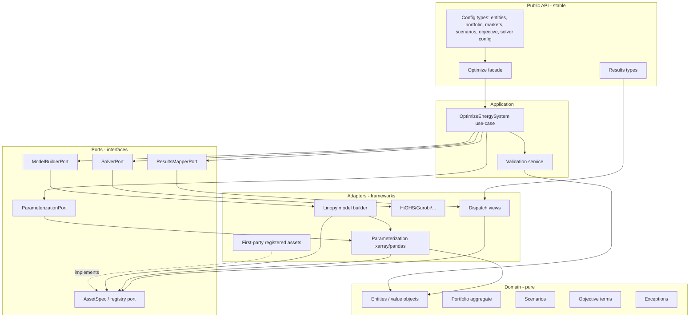

# Target architecture (ideal)

**Status:** proposed ideal — independent of current folder names
**Date:** 2026-08-01
**Constraint:** stochastic multi-asset energy MILP library (not a web service)

This document describes what “good” looks like for Odys if designed greenfield.
It intentionally does **not** start from `src/odys/**` layout. Mapping to a migration
path is in [roadmap.md](roadmap.md).

**Product boundary:** first-party assets only. Modular “asset” units below are **maintainer
registry modules** (entity + params + constraints + contributions), not a runtime user
extension API. Users configure supported types via the public domain API only.

## 1. Design principles

1. **Dependency rule** — knowledge flows inward: domain never imports model, solver, or results adapters.
2. **Open for first-party assets, closed for kernel** — adding a registered asset does not edit power balance, profit, builder switchboards, or the composition root.
3. **One ubiquitous language** — “asset”, “market”, “scenario”, “dispatch” mean one thing each.
4. **Frameworks at the edge** — `linopy` / solver bindings live only in the model-building and solving adapters.
5. **Public API is intentional** — configuration **and** results are stable; algebraic internals are not.
6. **System physics is a thin kernel** — balance and shared stage rules compose *contributions* from registered assets.

## 2. Layered view



### Dependency rules (enforceable)

| From \ To | Domain | Ports | Adapters | Public facade |
|-----------|--------|-------|----------|---------------|
| Domain | ✓ | ✗ | ✗ | ✗ |
| Ports | ✓ (types only) | ✓ | ✗ | ✗ |
| Adapters | ✓ | ✓ | limited | ✗ |
| Facade / app | ✓ | ✓ | ✓ wire-up only | — |

**Hard ban:** `domain` → anything that knows linopy, variable names, or solver status.

## 3. Bounded concepts

### 3.1 Domain aggregates

| Concept | Responsibility |
|---------|----------------|
| **Energy entity** | Named asset with physical/economic attributes; immutable |
| **Portfolio** | Unique names; typed membership; **no** knowledge of MILP registry |
| **Market environment** | Markets as a first-class collection (see ADR) — either inside portfolio *or* sibling aggregate, never half-and-half |
| **Scenario / StochasticScenario** | Uncertainty: profiles, prices, probability |
| **Objective** | Composable terms (profit, CVaR, …); domain-level weights/params only |
| **Validation service** | Cross-aggregate invariants before any numeric build |

### 3.2 Asset kinds (ubiquitous language)

| Kind | Decision vars? | Example |
|------|----------------|---------|
| **Dispatchable** | Yes | Generator, storage, flexible load, EV, market trade |
| **Passive** | No (parameters / profiles only) | FixedLoad |
| **Coupling infrastructure** | Yes, relational | Charger (links to EVs) |

Passive assets are not “unregistered accidents”; they are an explicit first-party kind.

## 4. First-party asset contract (core of evolvability)

Ideal **maintainer** extension unit — one registry registration, many hooks:

```text
AssetSpec (first-party registry member)
  identity:
    entity_type
    kind: dispatchable | passive | coupling
    dimension_name          # model index axis, if any
  domain:
    # optional portfolio filter helpers live with entity typing, not MILP
  parameterization:
    build_parameters(entities, context) -> AssetParameters   # as-is: *Parameters.build(ParamBuildContext) — G11a
    scenario_bindings(...) -> optional scenario tensors     # as-is: still kernel ScenarioParameters
  model:
    variables: list[VariableSpec]
    constraints(model_view, params) -> ConstraintGroup | empty
  system_contributions:     # composed by kernel — DO NOT edit kernel per asset
    power_balance_terms(model_view, params) -> LinearExpr terms
    profit_terms(model_view, params) -> LinearExpr terms
  results:
    bind_dispatch(solution, params) -> DispatchView
```

**Target KPI (maintainer):** adding a first-party dispatchable asset with minimal kernel edits.
No edits to `ScenarioConstraints` balance composition, profit aggregation, builder switchboards,
or `EnergySystem` per-asset lines.

**Product stance:** first-party `AssetRegistry` only — users do not inject custom assets at runtime.

**As-is progress:** kernel equations, builder vars/constraints, param construction, and results leaf
are registry/port driven. Remaining first-party touches: typed ESP field, MILP accessors (G12),
validation, optional results dispatch binding.

### System kernel (thin)

Always present, asset-agnostic:

- Time / scenario dimensions
- Power balance: `sum(asset.power_balance_terms) == 0`
- Expected profit / CVaR assembly from `asset.profit_terms` + objective terms
- Non-anticipativity / stage rules driven by **market (or stage) metadata**, not hardcoded var lists where avoidable
- Build-once guard; skip empty asset types via `params.is_empty`

### Objective terms (parallel to assets)

Objective terms (Profit, CVaR, future) are not assets:

```text
ObjectiveTerm
  domain_term_type
  optional_variables
  constraints(model_view, objective_params)
  objective_expression(model_view, per_scenario_profit, probabilities)
```

CVaR remains an objective term that *consumes* the kernel’s per-scenario profit expression.

## 5. Application flow (`optimize`)

```text
1. Parse / normalize inputs (Scenario → StochasticScenario, markets tuple)
2. Validate (domain service; pure)
3. Parameterize (all AssetPlugins + scenario params)
4. Build algebraic model (vars → constraints → objective via registry assets + kernel)
5. Solve (SolverPort)
6. Map results (ResultsMapper + asset dispatch binders)
7. Return stable Results DTO
```

Composition root wires concrete adapters once. Domain and asset modules do not construct solvers.

## 6. Results boundary

Results are **public** and depend only on a small **solution schema**:

```text
SolutionSchema
  dimensions: {name -> index labels}
  variables:  {name -> DataArray-like}
  metadata:   status, objective_value, solver_name, ...
```

Rules:

- Results adapters may know schema string names produced by assets they own
- Results must **not** import constraint modules or linopy model types
- Prefer not to hold the full parameterization object long-term; pass only what dispatch views need (ids, base profiles, timestep)
- Public `__all__` exports results root type(s) with a **correct** stable name

## 7. Validation structure

Keep validation in domain (correctness boundary). Prefer **composable validators** over one file that grows forever:

```text
validate_energy_system_inputs
  ├─ validate_scenario_probabilities_and_names
  ├─ validate_profile_shapes_and_keys
  ├─ validate_capacity_adequacy
  ├─ validate_market_price_coverage
  └─ validate_ev_charger_trip_graph
```

Size is acceptable if each unit is single-purpose and independently testable.
No optimization imports.

## 8. Framework & technology placement

| Concern | Allowed libs |
|---------|----------------|
| Domain | stdlib, pydantic, (pandas/numpy only if profiles are domain data — decide once) |
| Parameterization | pandas, xarray, numpy |
| Model builder | linopy, xarray |
| Solvers | linopy + highspy / gurobi / … |
| Results | xarray, pandas |
| Logging | utils |

## 9. Testing architecture

| Layer | Test style |
|-------|------------|
| Domain entities / validation | Pure unit tests, no solver |
| Single registry asset | Unit: params shape, constraint expressions against model fixtures |
| Kernel composition | Unit: registry contribution ports for present assets |
| Solver adapter | Thin integration against HiGHS |
| End-to-end | Integration: `EnergySystem.optimize` golden paths |
| First-party extension | Maintainer checklist: registry + params + constraints + ports + tests (no runtime inject) |

## 10. Package sketch (illustrative names)

Names are illustrative; migration may keep `odys.*` paths while adopting rules.

```text
odys/
  api.py / __init__.py          # stable exports
  domain/
    entities/
    portfolio.py                # no registry import
    scenarios.py
    objective.py
    validation/
    exceptions.py
  application/
    optimize.py                 # use-case
   ports/
     asset_spec.py               # first-party registry contract (not user plugins)
     parameterization.py
     model_builder.py
     solver.py
     results_mapper.py
   adapters/
     parameterization/
     linopy_model/
       kernel.py                 # balance, profit aggregate
       builder.py
    solvers/
    results/
  registered_assets/             # first-party only (mirrors AssetRegistry)
    generator/
    standalone_storage/
    flexible_load/
    fixed_load/                 # passive
    market/
    electric_vehicle/
    charger/
    objective_cvar/
```

Today’s `optimization/` roughly maps to `adapters/parameterization` + `adapters/linopy_model` +
parts of `registered_assets/` (params, constraints, contributions).

## 11. Explicit non-goals of the ideal

- Microservices / network boundaries
- Replacing linopy without a port (port exists so it *could* happen; not a near-term goal)
- Runtime user/third-party asset injection APIs
- Codegen-heavy frameworks unless boilerplate remains painful after modularizing first-party assets
- Perfect purity of pandas out of domain if scenario profiles stay user-facing domain data

## 12. Decisions (ADR-bound) — accepted Phase 0

| Topic | ADR | Decision |
|-------|-----|----------|
| Markets ownership | [0001](adr/0001-markets-ownership.md) | Sibling of portfolio (`EnergySystem.markets`), not portfolio members |
| Passive vs dispatchable | [0002](adr/0002-passive-vs-dispatchable-assets.md) | Explicit passive kind (target); FixedLoad migrates later (G15) |
| System contributions | [0003](adr/0003-system-contribution-ports.md) | Contribution ports on registry — **done** Phase 2 (G7); no runtime plugins |
| Results public API | [0004](adr/0004-results-public-api.md) | `OptimalDispatchResults` exported; hard rename; schema leaf — **done** Phase 3 (G8 + G9) |

**Parameterization (no separate ADR):** G11a implements `ParamBuildContext` +
`*Parameters.build(ctx)` + registry block loop + `build_energy_system_parameters`.
`EnergySystemParameters` is a closed typed bag of first-party blocks.

The ideal architecture above is aligned with these accepted ADRs and G11a (first-party spine).
