# Phase 3: Target model

Proposed data model for odys, following `ARCHITECTURE_REVIEW_METHODOLOGY.md`. It resolves the [Phase 2 findings](findings.md) under the decisions recorded at checkpoints 1 and 2 ([inventory](inventory.md) section 8, findings section 9):

- **User-owned vs. external:** the portfolio holds only entities the user owns. Markets are not portfolio members.
- **Storage is composed:** `StationaryStorage` and `ElectricVehicle` *have* a storage (a battery); they no longer inherit from one.
- **linopy stays:** it is a deliberate platform, contained inside `optimization/` and never abstracted.
- **Renames:** `TradeDirection` becomes `AllowedTradeDirection`, and `EnergySystemParameters` gets a self-describing name.
- **Scenarios are in scope:** `Scenario` is part of the redesign.

This is a design, not code. Names are proposals, and section 10 lists the ones that need your confirmation.

---

## 1. Design in one paragraph

Each kind of entity has **one domain class** (what the user describes, validated at construction) and **one formulation class** (how that kind of entity is written as MILP variables, constraints, balance and profit terms, and read back as results). The model builder, power balance, objective and results never branch on entity type. Instead, they iterate over the formulations present in the problem. Time series live in scenarios as **typed profiles that reference their entity**, so a profile cannot be attached to the wrong kind of asset. Storage physics is a **value object** that assets compose, and a single storage formulation serves both of them. linopy stays inside `optimization/`, while domain, parameters and results never import it.

---

## 2. Glossary (F-18)

| Term | Meaning | Class(es) |
| --- | --- | --- |
| **Entity** | A named thing in the energy system. | `EnergyEntity` (abstract) |
| **Asset** | An entity the user **owns and operates**. Only assets go in a portfolio. | `Asset` (abstract): `Generator`, `StationaryStorage`, `ElectricVehicle`, `Charger`, `FixedLoad`, `FlexibleLoad` |
| **Market** | An external venue where energy is exchanged. Not owned, and never in the portfolio. | `EnergyMarket` |
| **Battery** | The physics of storing energy: capacity, power limits, efficiencies, SOC window, losses. A value object with no name, owned by an asset. | `Battery` |
| **Horizon** | The time grid of one optimization: step length and number of steps. | `Horizon` |
| **Profile** | One exogenous time series for one entity in one scenario, such as demand, available capacity or price. | `Profile` (abstract): `Demand`, `AvailableCapacity`, `Price` |
| **Scenario** | A named, weighted realization of all profiles. | `Scenario` |
| **Scenario set** | The scenarios of one problem; owns the rules "probabilities sum to 1" and "names are unique". | `ScenarioSet` |
| **Objective term** | A weighted contribution to the objective. | `ObjectiveTerm` (abstract): `ProfitTerm`, `CVaRTerm` |
| **Formulation** | The MILP formulation of all entities of one type: their arrays, variables, constraints, and balance, profit and result extraction. | `Formulation` (abstract), one per entity type |
| **Model context** | Shared indexing of one problem: time and scenario coordinates, Δt, probabilities, and vectorized profiles. | `ModelContext` |
| **Optimization problem** | Everything needed to build the MILP: context, formulations, objective term formulations. **Replaces `EnergySystemParameters`.** | `OptimizationProblem` |
| **Solve outcome** | What the solver returns: status, termination, objective value, solution. | `SolveOutcome` |
| **Dispatch** | Result view for all entities of one type. | `Dispatch` (abstract), one per entity type |

---

## 3. Domain model

### 3.1 Class diagram

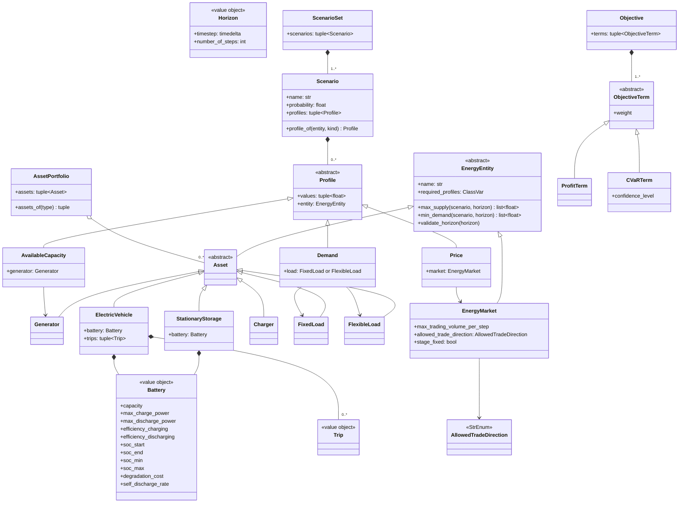

Every association in the diagram is a real object reference. The string-keyed "keyed by name" edge from Phase 1 is gone.

### 3.2 Decisions and the findings they resolve

| Decision | Resolves |
| --- | --- |
| **`Asset` base for user-owned entities.** `AssetPortfolio` accepts only `Asset` and raises `OdysValidationError` for anything else, such as a market. `EnergyMarket` extends `EnergyEntity` directly. There is no `Market` base yet: it has one user today and gets a base when a second product arrives (section 8, T2a). | F-10 |
| **`Battery` value object** composed into `StationaryStorage` and `ElectricVehicle`. The SOC validators move onto `Battery`. The `Storage` base class and its unused `asset_type()` are removed. | F-08 |
| **Entity invariants at construction.** EV trip overlap, and a departure SOC that `soc_start` cannot meet at t = 0, become `ElectricVehicle` validators. "Chargers if and only if EVs" becomes an `AssetPortfolio` invariant. Invalid entities can no longer exist. | F-03 |
| **Polymorphic capability queries** on `EnergyEntity`: `max_supply`, `min_demand` and `validate_horizon`. Each defaults to "none" and is overridden by generators, storage and markets (supply), by loads (demand), and by EVs (horizon). The system rules in `validation.py` iterate over entities instead of listing asset kinds, so a new asset type is covered automatically. | F-03 |
| **Typed profiles that reference their entity** (`Demand(load, values)`, `AvailableCapacity(generator, values)`, `Price(market, values)`). A wrong pairing is a type error. Each entity type declares `required_profiles` (for example `FixedLoad` requires `Demand`, `EnergyMarket` requires `Price`), and one generic rule checks every scenario against every entity. `Scenario` no longer has one field per asset kind. | F-09 |
| **One `Scenario` class** with `name="base"` and `probability=1.0` defaults. `StochasticScenario` is merged into it. **`ScenarioSet`** owns the collection invariants (probability sum with tolerance, unique names). `EnergySystem` accepts a `Scenario` or a sequence and normalizes it **once**, at construction, into a `ScenarioSet`. Markets are normalized once into a tuple. | F-09, F-20 |
| **`Horizon` value object** (`timestep`, `number_of_steps`), used by `EnergySystem`, EV trip checks and `ModelContext`. `EnergySystem` keeps its `timestep` and `number_of_steps` fields for convenience and exposes `horizon`. | F-03, F-15 |
| **`Objective` holds a tuple of terms** and becomes frozen. The default is `Objective(terms=(ProfitTerm(weight=1.0),))`. | F-11 |
| **Renames:** `TradeDirection` → `AllowedTradeDirection`; the field `trade_direction` → `allowed_trade_direction`. | F-18, checkpoint 1 |

---

## 4. Model side (`parameters/` and `optimization/`)

### 4.1 Class diagram

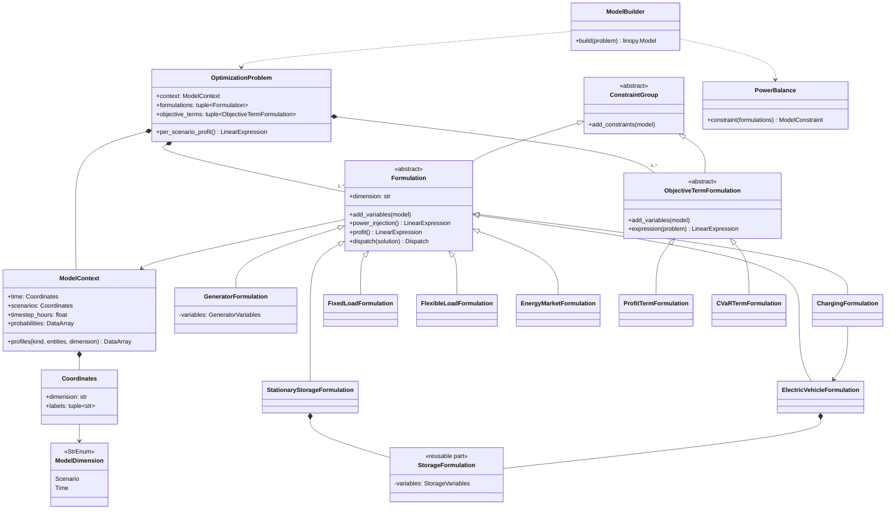

### 4.2 Decisions

| Decision | Resolves |
| --- | --- |
| **`Formulation`: one class per entity type**, vectorized over all entities of that type along its own dimension (`GeneratorFormulation` covers every generator). It owns, for that type: - its parameter arrays; - its variables, as a small typed object (`GeneratorVariables(power, status, startup, shutdown)`) created in `add_variables`, so presence is guaranteed; - its `@constraint` methods; - its `power_injection()` (supply minus demand, summed over its dimension); - its `profit()` per scenario; - its `dispatch(solution)`. It has 7 concrete users. | F-01, F-05, F-06, F-07 |
| **Each formulation owns its dimension name** (`dimension = "generator"`). `ModelDimension` keeps only the shared axes `Scenario` and `Time`. There is no per-asset enum member or `CoordinatesStore` field to keep in sync. | F-01, F-15 |
| **Constraint groups receive only their inputs.** `Formulation` extends the existing `ConstraintGroup` (`@constraint` discovery is kept, it works well). Its constraints read `self.variables` and `self` arrays, never a whole model. Absent entity types are never instantiated, so `None` checks disappear. | F-06 |
| **`StorageFormulation`: a reusable part**, not a subclass. It is parameterised by dimension and an optional SOC drop (trips). `StationaryStorageFormulation` and `ElectricVehicleFormulation` compose it (2 users), which mirrors the domain's `Battery` composition. | F-08 |
| **`ChargingFormulation`** handles chargers and receives the `ElectricVehicleFormulation` in its constructor. The coupling is explicit, and an arrow in the diagram, instead of a double `None` check. | F-06 |
| **`EnergyMarketFormulation`** owns market variables, volume and direction constraints, and **non-anticipativity** for `stage_fixed` markets. It moves out of `ScenarioConstraints`, which disappears. | F-01 |
| **`PowerBalance`** is one constraint: Σ `power_injection()` over all formulations = 0. It has no branch per asset. | F-01 |
| **`OptimizationProblem`** replaces `EnergySystemParameters`. It is "everything needed to build the MILP for one energy system": a `ModelContext`, the formulations for the entity types present, and the objective term formulations. `per_scenario_profit()` = Σ `formulation.profit()`. It is assembled by `OptimizationProblem.assemble(portfolio, markets, scenario_set, horizon, objective)`, which groups entities by type and looks up each type's formulation in **one** tuple, `FORMULATIONS` (the only per-type list in the model layer). | F-01, F-04, F-16 |
| **`ObjectiveTermFormulation`**: one per `ObjectiveTerm` type (`ProfitTermFormulation`, `CVaRTermFormulation`, 2 users). Each adds its own variables and constraints (CVaR's value-at-risk, shortfall and shortfall constraint) and returns its weighted expression. The objective is the sum of the terms. | F-11 |
| **`EnergyMILPModel`, `VariableStore`, `VariableDefinitionRegistry`, `AssetRegistry`, `CoordinatesStore`, `EnergySystemParameters` and `ScenarioConstraints` are removed.** `ModelBuilder` works on a plain `linopy.Model`, since linopy is the platform and there is nothing left to wrap. | F-02, F-05, F-07, F-15, F-16 |
| **`parameters/` becomes the xarray layer, below optimization:** - `ModelDimension`, `Coordinates`, `ModelContext`; - a generic `vectorize(entities, fields, dimension)`, which builds a `Dataset` from entity fields with unchanged names, replacing the hand-written properties of the six `*Parameters` classes; - profile vectorization (`context.profiles(Demand, loads, "fixed_load")`). It imports only `domain`, so the `parameters ⇄ optimization.model` cycle is gone. | F-15, F-17 |
| **One source of time labels.** `ModelContext.time` is the only producer of `str(t)` coordinates, and every array (including EV trip arrays) takes its coordinates from it. | F-15 |

### 4.3 Formulation interface

In words (types abbreviated):

- `add_variables(model: linopy.Model) -> None`: creates this formulation's typed variables object.
- `add_constraints(model: linopy.Model) -> None`: inherited from `ConstraintGroup`; runs the `@constraint` methods in definition order.
- `power_injection() -> LinearExpression | None`: this entity type's net power into the bus, per scenario and time. `None` for types outside the balance (chargers).
- `profit() -> LinearExpression | None`: this entity type's profit per scenario, with every energy term already multiplied by Δt.
- `dispatch(solution: xr.Dataset) -> Dispatch`: the result view for this entity type.

---

## 5. Boundaries, pipeline, solving and results

### 5.1 Package layering (target)

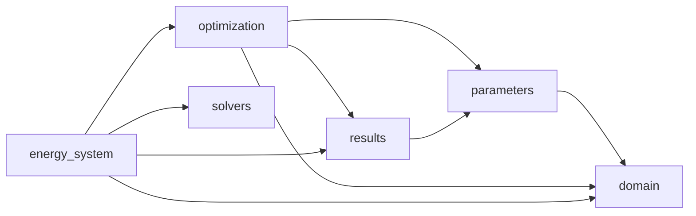

| Change | Resolves |
| --- | --- |
| **No package cycles.** `parameters` no longer imports `optimization`. `results` is a leaf of view types that imports only `parameters` (dimension names). `optimization` may import `results` because formulations build their own `Dispatch`. `solvers` imports none of odys' model layers: it takes a `linopy.Model` and returns a `SolveOutcome`. | F-13, F-15 |
| **linopy is contained.** Only `optimization` and `solvers` import it. A new import-linter contract forbids `linopy` in `domain`, `parameters` and `results` (`include_external_packages = true`). | F-12 |
| **`SolveOutcome`**: `solvers.solve(model, config) -> SolveOutcome` (odys-owned `SolveStatus`, termination, objective value, solution `Dataset`). The solver no longer builds results. | F-12, F-13 |
| **`DispatchOptimizer`**, a pipeline object in the composition root, runs `OptimizationProblem.assemble` → `ModelBuilder.build` → `solve` → `OptimalDispatchResults.from_outcome(outcome, problem)`. `EnergySystem` is the validated problem definition, and `EnergySystem.optimize()` stays as a thin façade. `build_parameters()` disappears. | F-04 |
| **`Dispatch` base class** implements the container protocol once (`__getitem__`, `__iter__`, `__len__`, `__contains__`, `to_dataset`, `to_dataframe`, `__repr__`) over its dimension, using `sel({self.dimension: key})`. Subclasses declare only their series. Every series property returns `pd.Series`, including `MarketDispatch.net_volume`. It has 7 users. | F-14 |
| **`OptimalDispatchResults`** (spelling fixed, exported in `__all__`) holds status, objective value, and a mapping from entity type to `Dispatch`. It keeps typed properties (`results.generators`, …) for users. Scenario squeezing for single-scenario runs happens here, once. | F-13, F-14, F-18 |

### 5.2 Solvers and results class diagram

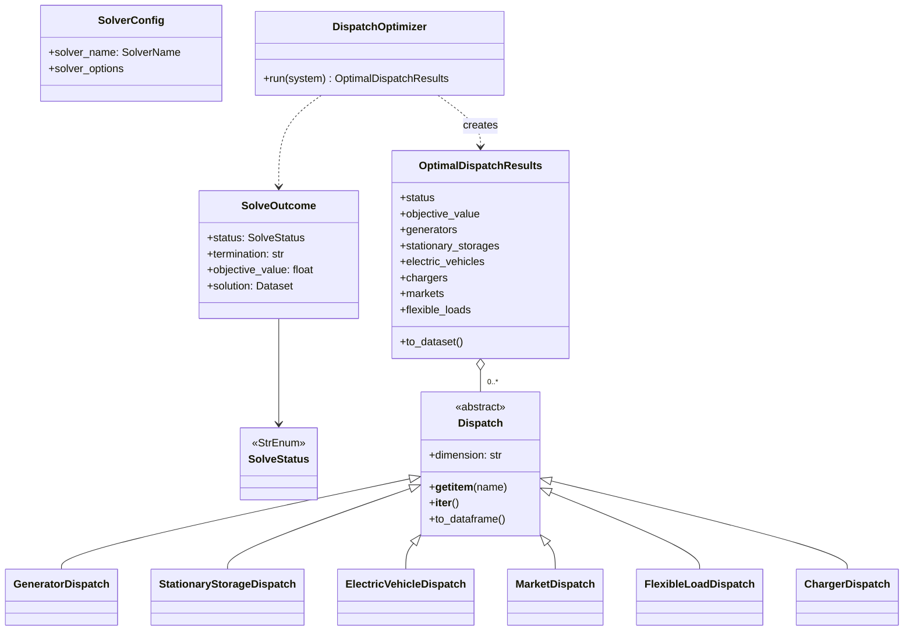

---

## 6. Sequence diagrams (same flows as Phase 1)

### 6.1 Construction and validation

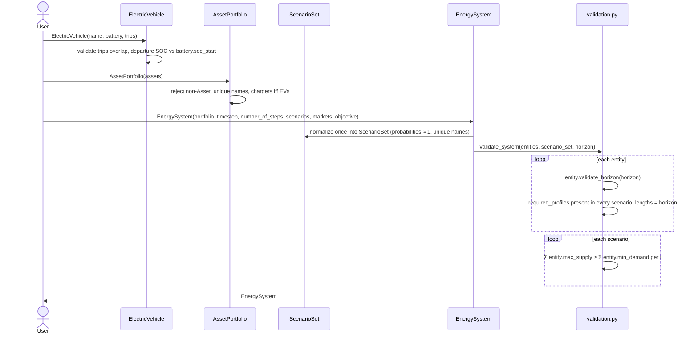

### 6.2 `EnergySystem.optimize()` end to end

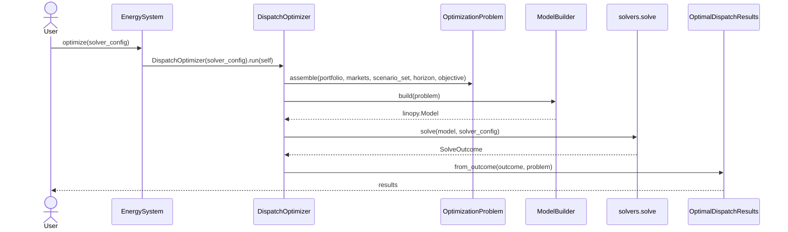

### 6.3 Problem assembly (replaces `build_parameters()`)

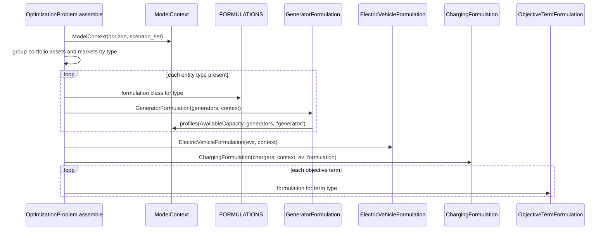

### 6.4 Model building

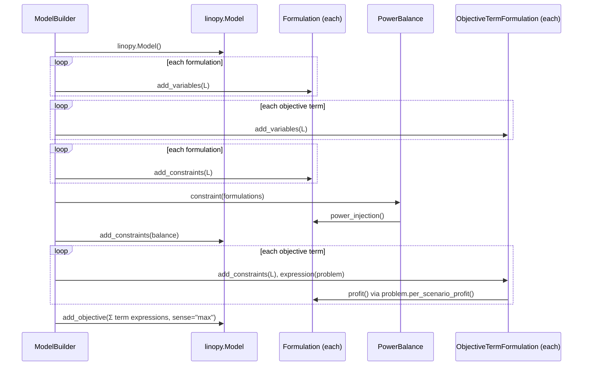

### 6.5 Results

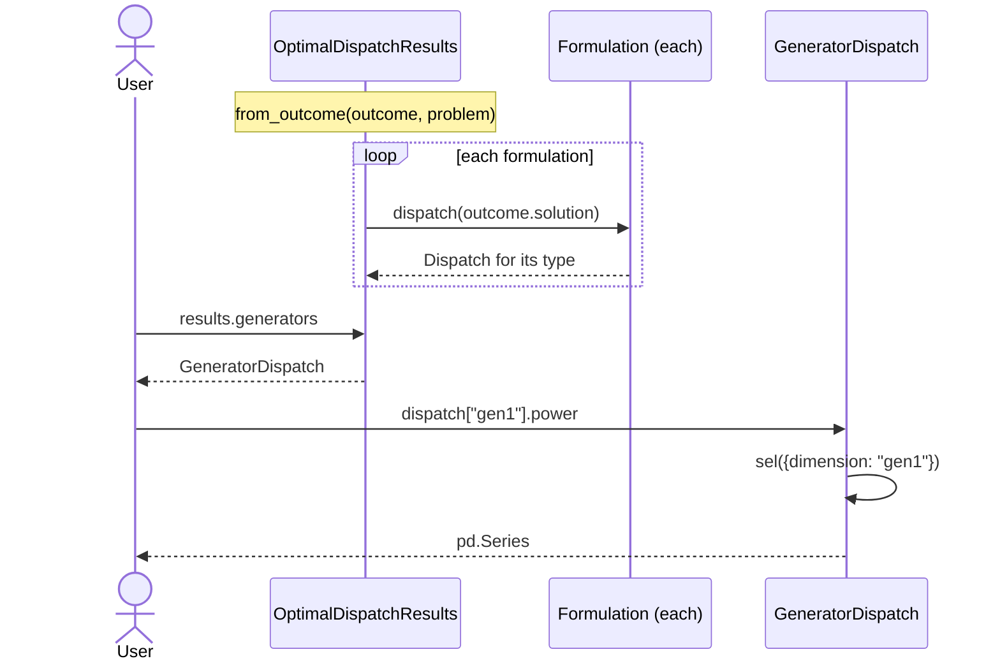

Each lifeline now has one role, and asset behaviour has a home: every per-type step is a message to a `Formulation`.

---

## 7. Findings coverage

| Finding | Resolution in this design | Section |
| --- | --- | --- |
| F-01 lockstep sites | `Formulation` per type; one `FORMULATIONS` tuple; generic balance, objective and results | 4.2 |
| F-02 unused `AssetRegistry` | Removed | 4.2 |
| F-03 anemic entities | Entity and portfolio invariants at construction; polymorphic capability queries | 3.2 |
| F-04 `EnergySystem` does everything | Problem definition plus thin façade; `DispatchOptimizer` pipeline | 5.1 |
| F-05 `EnergyMILPModel` god object | Removed; profit per formulation | 4.2 |
| F-06 groups navigate the whole model | Formulations use only their own variables and arrays | 4.2 |
| F-07 variables declared three times | Typed variables object per formulation | 4.2 |
| F-08 storage duplication and inheritance | `Battery` value object plus `StorageFormulation` part | 3.2, 4.2 |
| F-09 `Scenario` per-kind fields and strings | Typed profiles referencing entities; `required_profiles` | 3.2 |
| F-10 market in portfolio | `Asset` base; portfolio rejects markets | 3.2 |
| F-11 closed `Objective` | Tuple of terms plus `ObjectiveTermFormulation` | 3.2, 4.2 |
| F-12 linopy everywhere | Contained in `optimization` and `solvers`; import-linter contract; **full abstraction deferred (backlog)** | 5.1 |
| F-13 solver builds results | `SolveOutcome`; results built from formulations | 5.1 |
| F-14 duplicated dispatch | `Dispatch` base; consistent return types | 5.1 |
| F-15 dimensions and coordinates cycle | `parameters/` below `optimization/`; one time-label source | 4.2 |
| F-16 `EnergySystemParameters` naming | `OptimizationProblem` | 4.2 |
| F-17 `*Parameters` boilerplate | Generic `vectorize` | 4.2 |
| F-18 naming | Glossary; `AllowedTradeDirection`, `OptimalDispatchResults` | 2 |
| F-19 ignored inputs | Fixed in `7c67484`; `Charger.efficiency` kept as a TODO | none |
| F-20 union inputs | Normalized once into `ScenarioSet` and a tuple | 3.2 |

### New abstractions and their concrete users

| Abstraction | Users |
| --- | --- |
| `Asset` | 6 asset classes |
| `Battery` | `StationaryStorage`, `ElectricVehicle` |
| `Profile` | `Demand`, `AvailableCapacity`, `Price` |
| `Horizon` | `EnergySystem`, `ElectricVehicle.validate_horizon`, `ModelContext` |
| `Formulation` | 7 formulations |
| `StorageFormulation` | stationary storage and EV formulations |
| `ObjectiveTermFormulation` | profit, CVaR |
| `Dispatch` | 7 dispatch classes |
| capability queries on `EnergyEntity` | supply: generator, storage, EV, market; demand: fixed and flexible load |

---

## 8. Stress scenarios on the target design

### T1: add a new asset type (heat pump)

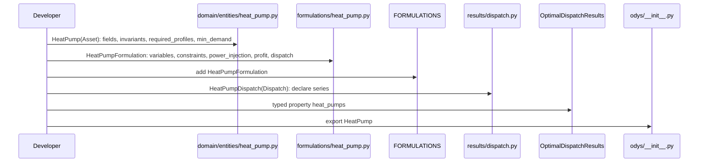

**Before: 18 `src/` files** (3 new, 15 modified). **After: 6 touch points in 5 files** (2 new). Validation, the balance, the objective, coordinates and the builder need no change. The typed results property is the one remaining per-type site, kept deliberately for user ergonomics (section 10, question 5).

### T2a: add a reserve market (a second market product)

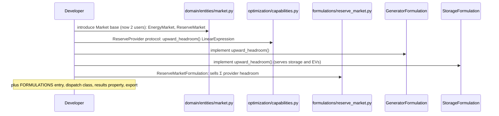

**Before: ~18 files.** **After: ~9 files**, each an addition. `Price` is widened from `EnergyMarket` to `Market`. The cross-asset coupling is declared once, as a protocol with 3 implementers (so it passes the two-users rule when built), instead of being edited into each constraint group.

### T2b: add an objective term (peak-demand charge)

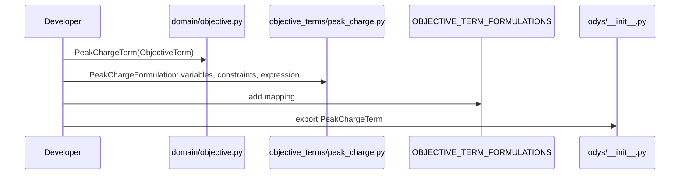

**Before: 7-8 files.** **After: 4.** `Objective`, the builder and other terms are untouched.

### T3: second solver or second modeling layer

- **New solver inside linopy:** unchanged, 2 files (`SolverName` plus a translator).
- **New modeling layer:** still a rewrite of `optimization/formulations`, which is expected since linopy is the platform. But `domain`, `parameters`, `results`, the public API and `SolveOutcome` stay untouched, whereas before results and the solver also changed. The import-linter contract keeps it that way.

---

## 9. Public API changes

Pre-1.0, breaking is allowed (methodology section 2). Every change is listed here and must be in `CHANGELOG.md` when implemented.

| Before | After | Kind |
| --- | --- | --- |
| `TradeDirection`, `EnergyMarket.trade_direction` | `AllowedTradeDirection`, `allowed_trade_direction` | rename |
| `StandaloneStorage(capacity=..., ...)` | `StationaryStorage(name, battery=Battery(capacity=..., ...))` | rename and constructor shape |
| `ElectricVehicle(capacity=..., trips=...)` | `ElectricVehicle(name, battery=Battery(...), trips=...)` | constructor shape |
| `Storage` (abstract, public in docs) | removed; `Battery` value object | removal |
| `Scenario(fixed_load_profiles={"load": [...]}, market_prices={...})` | `Scenario(profiles=(Demand(load, [...]), Price(market, [...])))` | constructor shape |
| `StochasticScenario(name, probability, ...)` | `Scenario(name, probability, profiles=...)` | merge |
| `Objective(profit=..., cvar=...)` | `Objective(terms=(ProfitTerm(...), CVaRTerm(...)))` | constructor shape |
| `AssetPortfolio` accepts any entity; `.generators`, `.standalone_storages`, … | accepts only `Asset`; `assets_of(Generator)` | behaviour and accessor |
| `results.standalone_storages`, `StandaloneStorageDispatch` | `results.stationary_storages`, `StationaryStorageDispatch` | rename |
| EV trip and departure-SOC errors raised at `EnergySystem(...)` | raised at `ElectricVehicle(...)` | earlier error |
| `EnergySystem.build_parameters()` | removed (internal) | removal |
| `OptimalDisptachResults` (not exported) | `OptimalDispatchResults` (exported) | rename and export |
| `MarketDispatch.net_volume -> xr.DataArray` | `-> pd.Series` | return type |
| `results.solver_status` (linopy value strings) | odys `SolveStatus` | type |

Unchanged: `EnergySystem(...)` field names, `optimize(solver_config)`, `SolverConfig`, `Generator`, `FixedLoad`, `FlexibleLoad`, `Charger`, `Trip`, and the other typed results properties.

---

## 10. Alternatives considered and rejected

- **Behaviour on domain entities (for example `Generator.add_constraints(model)`):** rejected because it would put linopy and xarray into `domain` and break the layering.
- **A registry that auto-registers formulations via `__init_subclass__`:** rejected because it depends on import side effects. One explicit `FORMULATIONS` tuple is easier to read and test.
- **Scenario profiles as `Mapping[str, Mapping[ProfileKind, Sequence[float]]]`:** rejected because it keeps string references. Typed profiles make wrong pairings unrepresentable.
- **`ElectricVehicleFleetFormulation` merging EVs and chargers:** rejected because it gives one class two entity types. `ChargingFormulation` with an explicit EV dependency keeps one type per formulation.
- **A `Market` base class now:** deferred because it has one user. It is introduced with the second market product (T2a).
- **Keeping `EnergyMILPModel` as a thin wrapper:** rejected because it has no responsibility left once profit, variables and parameters move out.
- **Abstracting linopy:** rejected (checkpoint 2, decision 4).
- **Generic results access only (`results.dispatch(Generator)`):** rejected for now because typed properties give users autocomplete. They are the one per-type site that remains.

---

## 11. Checkpoint 3: questions for the user

1. **Formulation:** is `Formulation` (for example `GeneratorFormulation`) the right name for the model-side class per entity type? Alternatives: `GeneratorBlock`, `GeneratorModel`.
2. **`OptimizationProblem`:** is this the self-describing name you want for today's `EnergySystemParameters`?
3. **Battery:** you called it "a Storage (aka a battery)". `Battery` avoids the awkward `StandaloneStorage(storage=Storage(...))`. Is `Battery` fine, or do you prefer `Storage`?
4. **Typed profiles:** are you happy with `Scenario(profiles=(Demand(load, [...]), Price(market, [...])))`, which references entity objects instead of name strings? It is safer, but slightly more verbose for users.
5. **Portfolio and results accessors:** should `AssetPortfolio` drop its per-type properties in favour of `assets_of(Type)`, while results keep their typed properties (as proposed)?

---

## 12. Checkpoint 3 decisions

Recorded from the user's review (2026-10-01).

1. **`Formulation`** is the name of the model-side class per entity type (`GeneratorFormulation`, …).
2. **`OptimizationProblem`** replaces `EnergySystemParameters`.
3. **Storage naming:** `Battery` is the value object, and `StandaloneStorage` is renamed **`StationaryStorage`** (the asset is the stationary site; the battery is its physics). Results property `standalone_storages` → `stationary_storages`.
4. **Typed profiles** referencing entity objects are accepted: `Scenario(profiles=(Demand(load, [...]), Price(market, [...])))`.
5. **`AssetPortfolio`** drops its per-type properties in favour of `assets_of(Type)`. Results keep their typed properties.
6. **Profile names** (2026-10-03, during R2.2): `Demand`, `AvailableCapacity` and `Price` are named **`LoadProfile`**, **`AvailableCapacityProfile`** and **`PriceProfile`**. The class names use industry terms and do not clash with variable names such as `demand`. The design text above keeps the original names.
7. **Profile requirements live on the profile type** (2026-10-03, during R2.3): each `Profile` subclass declares `entity_types` and `required` as ClassVars (for example `LoadProfile` applies to `FixedLoad` and `FlexibleLoad` and is required), instead of `required_profiles` on the entity as in section 3. `profiles.py` imports the entity classes, so an entity cannot reference a profile class at runtime without an import cycle.
8. **Capability queries take one `OperatingConditions` argument** (2026-10-03, during R2.3): `max_supply`, `min_demand` and `max_energy_supply` take `OperatingConditions(horizon, profile_values)` instead of `(scenario, horizon)`. ruff's unused-argument rule is enabled and `typing.override` is not available on Python 3.11, so defaults and overrides that ignore one of two arguments would need suppressions. `max_energy_supply` is a fourth query, added because a battery's energy is bounded by its capacity, not only by its power.
