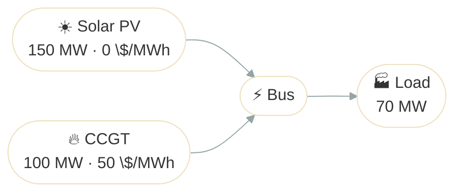

# Basic Dispatch

## Problem Description

This example asks a simple but important question: if a load must be met at every timestep, how should Odys dispatch a cheap renewable generator and a more expensive thermal unit?

The setup is intentionally small. We have a fixed 70 MW load over 24 hourly periods, a free solar plant with time-varying availability, and a gas turbine with a marginal cost of 50 $/MWh. The optimizer should use solar whenever it is available and only call on gas when solar is not enough.

That makes this a good first example because it shows the core Odys workflow without adding storage or markets.



**Source**: [`examples/basic_dispatch.py`](https://github.com/ramirocrc/odys/blob/main/examples/basic_dispatch.py)

## Walkthrough

### 1. Define the assets

Start by creating the two generators and the fixed load. This is the part where we tell Odys what can produce power, what it costs, and what demand must be served.

```python
from datetime import timedelta

from odys import AssetPortfolio, EnergySystem, FixedLoad, Generator, Scenario

ccgt = Generator(name="ccgt", nominal_power=100, variable_cost=50)
solar_pv = Generator(name="solar_pv", nominal_power=150, variable_cost=0)
load = FixedLoad(name="load")
portfolio = AssetPortfolio([ccgt, solar_pv, load])
```

Here the cost difference does most of the work. Solar is free, so the solver will prefer it whenever it is available.

### 2. Describe what is available

Now give Odys a time series for the solar PV available capacity and the load.

The solar profile represents the maximum available capacity of the solar PV
plant throughout the day. At night it is zero, then it increases as the sun
rises and falls again toward evening. The important detail is that the
available solar capacity does not have to match the panel's maximum rating.
The plant may be able to produce up to 150 MW in principle, but at each
timestep the actual limit is whatever the solar resource allows. During peak
hours the available capacity reaches 125 MW, well above the 70 MW load.

The ccgt is simpler: we treat it as fully available during the selected period,
so it can produce up to its nominal capacity in every timestep. That gives the
optimizer a reliable backup when solar is not enough.

Finally, the load is fixed. Odys must serve that demand at every step, so the
problem is really about deciding how much solar to use first and how much gas
is needed to cover the remainder.

```python
scenario = Scenario(
    available_capacity_profiles={
        "ccgt": 24 * [100],
        "solar_pv": [0, 0, 0, 0, 0, 0, 10, 30, 60, 90, 110, 120, 125, 120, 110, 90, 60, 30, 10, 0, 0, 0, 0, 0],
    },
    fixed_load_profiles={"load": 24 * [70]},
)
```

Notice the subtle point here: the gas turbine has a nominal capacity of 100 MW, but solar is limited by its profile. In other words, installed capacity is not the same thing as what is actually usable in a given timestep. And when available solar exceeds demand, the optimizer can only dispatch what the load requires; the rest is curtailed.

### 3. Solve the system

Once the portfolio and scenario are in place, the optimizer can build the least-cost dispatch.

```python
energy_system = EnergySystem(
    portfolio=portfolio,
    timestep=timedelta(hours=1),
    number_of_steps=24,
    scenarios=scenario,
)
```

At this point the solver is doing the real work: it balances the load in every step while trying to use the cheapest energy first.

## Results

The chart below shows the generator dispatch over time as stacked bars. Solar PV is used first whenever available (zero marginal cost), and CCGT fills the remaining demand. The dashed green line shows the available solar capacity, while the dashed gray line shows the constant load.

<iframe src="../assets/examples/basic_dispatch.html" style="width:100%; height:500px; border:none;" loading="lazy"></iframe>

If you print `result.generators.power`, the pattern should be easy to read:

- solar is used first whenever it is available
- gas fills the remaining demand
- total supply always matches the fixed load

The dashed green line shows the available solar capacity. Notice that during the middle hours (timesteps 9-15), the solar capacity exceeds the load. The optimizer can only dispatch what the load needs, so some solar generation goes unused. This is curtailment.

## Discussion

This example is the baseline for the rest of the docs. It shows the main idea behind optimization in Odys: define the assets, define what is available, define what must be served, and let the solver find the cheapest feasible dispatch.

A useful mental model is a household budget. Solar is the income you would rather spend first because it is free, while gas is the emergency fund you only use when necessary.
