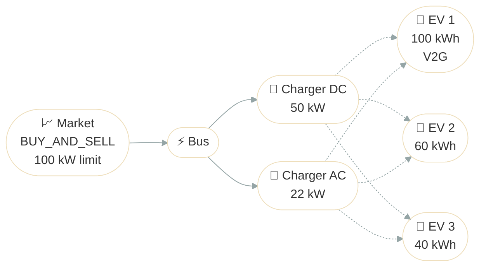

# EV Fleet Optimization

Optimize a fleet of delivery EVs with vehicle-to-grid (V2G) capability, trip schedules, and limited charger infrastructure. The optimizer decides when to charge, when to discharge to the grid, and how to share chargers, while guaranteeing every trip departs on time.

## Problem Description

A commercial depot operates 3 delivery EVs with 2 chargers and access to a wholesale market with time-of-use pricing. The fleet must complete staggered trips throughout the day while the optimizer exploits price differences: buying cheap overnight energy and selling it back during expensive peaks through the V2G-capable vehicle.

- **ev_1**: V2G-capable (100 kWh, 22 kW charge / 11 kW discharge), 3 trips, starts at 80% SoC, must end at 30%
- **ev_2**: Charge-only (60 kWh, 22 kW), 3 trips, starts at 50% SoC, must end at 60%
- **ev_3**: Charge-only (40 kWh, 7 kW), 2 trips, starts at 50% SoC, must end at 50%



The dashed lines show all possible charger-to-EV connections. The optimizer dynamically assigns EVs to chargers at each timestep (one EV per charger, one charger per EV), and assignments shift throughout the day based on trip schedules and price signals.

**Source**: [`examples/ev_fleet_optimization.py`](https://github.com/ramirocrc/odys/blob/main/examples/ev_fleet_optimization.py)

## Walkthrough

### 1. Define the EV fleet and chargers

Each EV is an [ElectricVehicle](../api/domain/entities/electric_vehicle.md) with trip schedules and optional V2G capability. Trips consume energy and make the vehicle unavailable for charging during the trip window. The key fields for ev_1:

```python
from datetime import timedelta

from odys import (
    AssetPortfolio,
    Charger,
    ElectricVehicle,
    EnergyMarket,
    EnergySystem,
    Scenario,
    TradeDirection,
    Trip,
)

ev_1 = ElectricVehicle(
    name="ev_1",
    capacity=0.100,  # 100 kWh
    max_charge_power=0.022,  # 22 kW
    max_discharge_power=0.011,  # 11 kW V2G
    soc_start=0.8,
    soc_end=0.3,
    trips=(
        Trip(
            name="morning_delivery",
            start_time=7,
            end_time=9,
            energy_consumption=0.015,  # 15 kWh
            min_soc_at_departure=0.6,
        ),
        Trip(
            name="midday_delivery",
            start_time=11,
            end_time=12,
            energy_consumption=0.010,  # 10 kWh
            min_soc_at_departure=0.4,
        ),
        Trip(
            name="afternoon_delivery",
            start_time=14,
            end_time=16,
            energy_consumption=0.012,  # 12 kWh
            min_soc_at_departure=0.3,
        ),
    ),
)
```

`max_discharge_power` is what enables V2G. Without it, the vehicle can only charge. `min_soc_at_departure` guarantees the vehicle has enough charge before each trip. The [Charger](../api/domain/entities/charger.md) objects are plain power limits:

```python
charger_dc = Charger(name="charger_dc", max_power=0.050)  # 50 kW
charger_ac = Charger(name="charger_ac", max_power=0.022)  # 22 kW
```

Unlike [Storage](../user_guide/storage.md), EVs must be assigned to chargers, and each charger serves at most one EV at a time. With 2 chargers and 3 EVs, there is charger competition.

ev_2 (60 kWh, charge-only, 3 trips) and ev_3 (40 kWh, charge-only, 2 trips) follow the same pattern. See the [full source](https://github.com/ramirocrc/odys/blob/main/examples/ev_fleet_optimization.py).

### 2. Add the market with buy-and-sell capability

```python
market = EnergyMarket(
    name="grid_market",
    max_trading_volume_per_step=0.100,  # 100 kW
    trade_direction=TradeDirection.BUY_AND_SELL,
)

portfolio = AssetPortfolio(
    assets=[ev_1, ev_2, ev_3, charger_dc, charger_ac],
)
```

The [buy-and-sell market](../user_guide/market.md) is what enables V2G arbitrage. ev_1 can discharge back to the grid during expensive peak hours.

### 3. Define the scenario with price signals

```python
market_prices = [
    5.0, 5.0, 5.0, 5.0, 5.0, 5.0,        # overnight: cheap
    20.0, 20.0,                            # morning ramp
    80.0, 80.0,                            # morning peak: expensive
    10.0, 10.0, 10.0, 10.0, 10.0,         # midday: cheap
    25.0, 25.0,                            # evening ramp
    100.0, 100.0, 100.0, 100.0,           # evening peak: very expensive
    5.0, 5.0, 5.0,                         # late evening: cheap
]

scenario = Scenario(
    market_prices={"grid_market": market_prices},
)
```

The chart below shows the price signal with trip schedules shaded, so you can see which vehicles are on the road and unavailable for charging at each timestep.

<iframe src="../assets/examples/ev_fleet_setup.html" style="width:100%; height:520px; border:none;" loading="lazy"></iframe>

### 4. Solve and inspect the results

```python
energy_system = EnergySystem(
    portfolio=portfolio,
    markets=market,
    timestep=timedelta(hours=1),
    number_of_steps=24,
    scenarios=scenario,
)

result = energy_system.optimize()
```

The [objective](../user_guide/optimization.md) maximizes expected profit, so `result.objective_value` is the depot's profit over the day (positive = revenue).

## Results

One shared time axis, four views: the price signal, every charge/discharge decision, its consequence on each battery, and the physical charger that delivered it.

<iframe src="../assets/examples/ev_fleet_dispatch_combined.html" style="width:100%; height:1200px; border:none;" loading="lazy"></iframe>

Notice how the optimizer responds to the price signal:

- **ev_1 discharges during every peak it can access.** It sells into the morning ramp at 20 $/MWh (t6), the morning peak at 80 $/MWh (t9), the evening ramp at 25 $/MWh (t16), and across the full evening peak at 100 $/MWh (t17–t20). That is V2G arbitrage: buy at 5 $/MWh overnight, sell at 20–100 $/MWh during peaks.
- **ev_2 and ev_3 charge at the cheapest hours.** ev_2 charges 22 kW at t0 and 5 kW at t21 (both at 5 $/MWh) to reach its 60% end-of-day target. ev_3 charges minimally at t21–t22 (5 $/MWh) to meet its 50% target.
- **The optimal solution requires switching EVs to different chargers during the day.** This is not practical in real operations, and can be avoided by setting constraints (to be implemented soon).

The economics chart below shows the market transactions that drive the profit.

<iframe src="../assets/examples/ev_fleet_economics.html" style="width:100%; height:500px; border:none;" loading="lazy"></iframe>

## Discussion

V2G arbitrage is the profit driver. ev_1 is the only vehicle that can discharge back to the grid, and the optimizer uses it as a flexible generator during expensive hours. The end-of-day SoC constraint is part of the trading strategy: the optimizer drains ev_1 to 0% during the evening peak, then repurchases exactly the 30% target at the cheapest price left on the clock. Every SoC constraint binds with zero margin: ev_1 ends at exactly 0.30, ev_2 at exactly 0.60, ev_3 at exactly 0.50. The optimizer spends no more than necessary to meet the requirements.

Charger sharing is not vehicles waiting their turn. It is the optimizer reassigning a vehicle to a different physical charger for exactly as long as needed. Three vehicles but only two chargers means the optimizer must decide who charges when, based on trip deadlines and price signals. The result is a schedule where charger assignments shift dynamically to resolve contention.

## Next steps

This example used deterministic prices and fixed trip schedules. In practice, both are uncertain: a delayed delivery changes when the vehicle is available to charge, and real-time prices deviate from day-ahead forecasts.

See [Stochastic Optimization](../user_guide/stochastic.md) to model uncertain trip schedules, or [CVaR Market Risk](cvar_market_risk.md) to learn how to hedge against price uncertainty.
