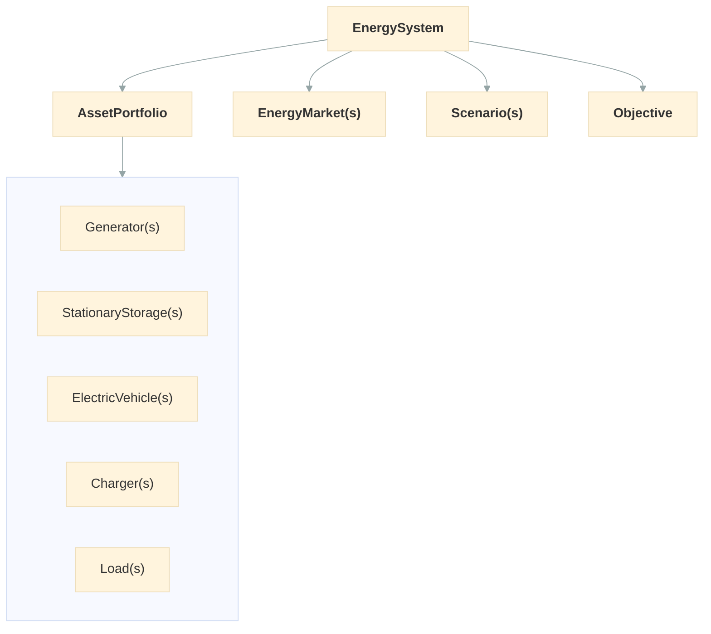

# EnergySystem

`EnergySystem` is the main entry point for setting up and running an optimization. Let's give it a portfolio of assets, scenario data, and time configuration -- then call `.optimize()`.

We designed `EnergySystem` as a single orchestrator because energy optimization involves multiple moving parts: assets, scenarios, time, and markets. Keeping them together in one object makes the workflow straightforward and validates everything at once.

Here's how the main objects relate to each other:



## Basic usage

Let's set up our first system.

```python
from datetime import timedelta

from odys import AssetPortfolio, LoadProfile, EnergySystem, FixedLoad, Generator, Scenario

generator = Generator(name="gen", nominal_power=100.0, variable_cost=50.0)
load = FixedLoad(name="demand")

portfolio = AssetPortfolio([generator, load])

energy_system = EnergySystem(
    portfolio=portfolio,
    scenarios=Scenario(
        profiles=(LoadProfile(load=load, values=[60, 90, 40, 70]),),
    ),
    timestep=timedelta(hours=1),
    number_of_steps=4,
)

result = energy_system.optimize()
```

## Constructor parameters

| Parameter         | Type                                             | Required | Default | Description                                              |
| ----------------- | ------------------------------------------------ | -------- | ------- | -------------------------------------------------------- |
| `portfolio`       | `AssetPortfolio`                                 | Yes      | -       | The collection of energy assets                          |
| `scenarios`       | `Scenario` or `list[Scenario]`                   | Yes      | -       | Scenario data (demand, available capacity and price profiles) |
| `timestep`        | `timedelta`                                      | Yes      | -       | Duration of each time period                             |
| `number_of_steps` | `int`                                            | Yes      | -       | How many timesteps to optimize over                      |
| `markets`         | `EnergyMarket` or `list[EnergyMarket]` or `None` | No       | `None`  | Energy markets for buying/selling                        |
| `objective`       | `Objective`                                      | No       | `Objective()` | Objective configuration. Defaults to maximize expected profit |

## Scenarios

Pass a single `Scenario` for a deterministic problem, or a list of scenarios with names and probabilities to account for uncertainty. Profiles reference the assets they belong to.

For a single deterministic scenario:

```python
from odys import AvailableCapacityProfile, LoadProfile, Scenario

scenario = Scenario(
    profiles=(
        LoadProfile(load=load, values=[60, 90, 40, 70]),
        AvailableCapacityProfile(generator=generator, values=[100, 80, 100, 100]),
    ),
)
```

For stochastic optimization, pass a list of scenarios whose probabilities sum to 1:

```python
from odys import AvailableCapacityProfile, LoadProfile, Generator, Scenario

wind = Generator(name="wind", nominal_power=150.0, variable_cost=0.0)

scenarios = [
    Scenario(
        name="low_wind",
        probability=0.3,
        profiles=(
            LoadProfile(load=load, values=[80, 90, 70, 60]),
            AvailableCapacityProfile(generator=wind, values=[30, 20, 40, 25]),
        ),
    ),
    Scenario(
        name="high_wind",
        probability=0.7,
        profiles=(
            LoadProfile(load=load, values=[80, 90, 70, 60]),
            AvailableCapacityProfile(generator=wind, values=[120, 140, 100, 130]),
        ),
    ),
]
```

See [Stochastic Optimization](stochastic.md) for more details.

## Adding markets

To include energy markets, pass them via the `markets` parameter:

```python
from odys import EnergyMarket, PriceProfile

sdac = EnergyMarket(name="sdac", max_trading_volume_per_step=150)
sidc = EnergyMarket(name="sidc", max_trading_volume_per_step=100)

energy_system = EnergySystem(
    portfolio=portfolio,
    markets=(sdac, sidc),
    scenarios=Scenario(
        profiles=(
            LoadProfile(load=load, values=[60, 90, 40, 70]),
            PriceProfile(market=sdac, values=[50, 55, 45, 60]),
            PriceProfile(market=sidc, values=[52, 58, 40, 65]),
        ),
    ),
    timestep=timedelta(hours=1),
    number_of_steps=4,
)
```

Notice that market prices are specified in the scenario, not on the market object. We chose this design because prices vary over time and across scenarios, while market properties (like trading limits) stay fixed. Keeping time-varying data in scenarios keeps the model clean.

See [Market](market.md) for details.

## Configuring the objective

By default, Odys maximizes expected profit. To balance profit against risk, pass an `Objective` with a CVaR term:

```python
from odys import CVaRTerm, Objective, ProfitTerm

energy_system = EnergySystem(
    portfolio=AssetPortfolio([generator, wind, load]),
    scenarios=scenarios,
    timestep=timedelta(hours=1),
    number_of_steps=4,
    objective=Objective(
        terms=(
            ProfitTerm(weight=1.0),
            CVaRTerm(weight=0.5, confidence_level=0.95),
        ),
    ),
)
```

See [Optimization](optimization.md) for the full objective formulation, and the [CVaR Market Risk example](../examples/cvar_market_risk.md) for a worked scenario.

## Running the optimization

Call `.optimize()` to build and solve the mathematical model:

```python
result = energy_system.optimize()
```

This returns an `OptimalDispatchResults` object. See [Optimization](optimization.md) for how to read and interpret the results.

## Validation

Creating an `EnergySystem` validates the whole configuration and raises an `OdysValidationError` on the first problem it finds. Checks that concern a single object, such as overlapping EV trips or an available capacity above a generator's nominal power, already ran when that object was built. The system-level checks are:

- `timestep` is positive and `number_of_steps` is at least 1
- scenario probabilities sum to 1 and scenario names are unique
- every profile references an asset of the portfolio or one of the markets
- every load has a `LoadProfile`, and every market a `PriceProfile`, in every scenario
- every profile has `number_of_steps` values, and every EV trip ends within the horizon
- in every scenario and at every timestep, the maximum supply (generators, storage and EV discharge, market volume) covers the minimum demand (fixed loads, plus flexible loads after their maximum decrease)
- without markets, the energy available over the horizon covers the minimum energy demand

## What happens under the hood

When you call `.optimize()`, odys:

1. Builds a mixed-integer linear program (MILP) using linopy from the validated configuration
2. Solves it with the HiGHS solver (or the solver you configure)
3. Wraps the solution in an `OptimalDispatchResults` object

You don't need to interact with any of these internals -- but if you're curious, the [API Reference](../api/energy_system.md) has the full details.

## Next steps

Now that you've seen the complete workflow, let's dive into each asset type. See [Generator](generator.md) to understand how to model power sources.
